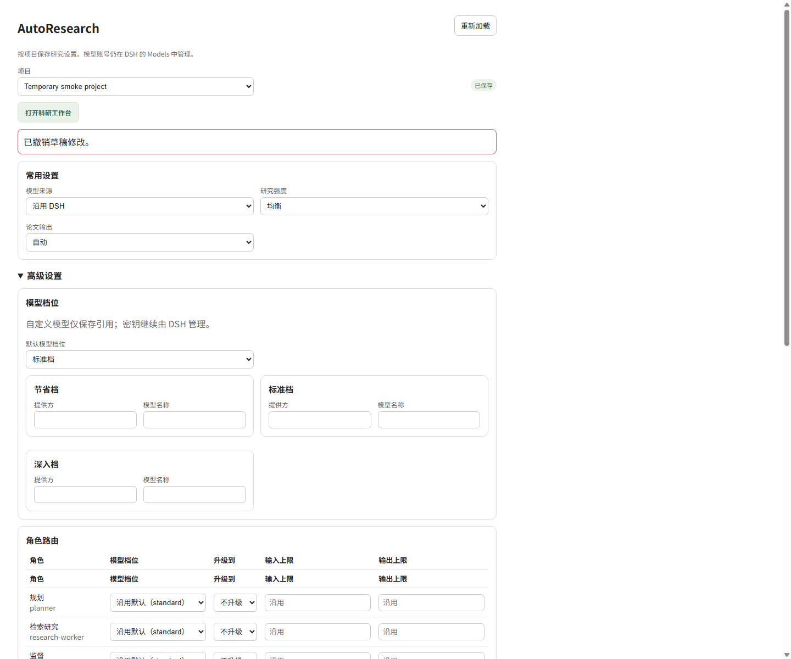
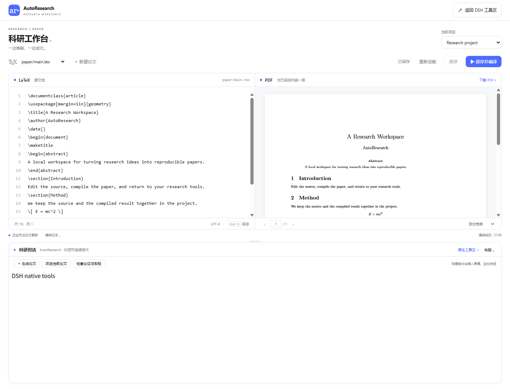
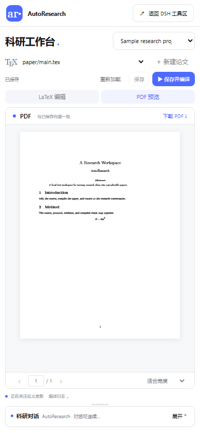

# AutoResearch：面向 DSH 的可恢复自动研究闭环

AutoResearch 是一个以 DSH Agent/Subagent 为执行底座的源码仓库项目。核心包把研究任务组织为可恢复的闭环：

```text
idea → plan → work → evidence → decide → paper | failure report
```

它既可以完成文献探索、独立实验和论文流水线，也可以通过可选 Web 包提供项目设置与对话式 LaTeX/PDF 工作台。当前部署方式是从本仓库源码构建并链接到 DSH profile；这里不承诺 npm registry 发布状态，也不宣称兼容任意最新 DSH。当前依赖锚点见各包 `package.json`，升级宿主后应重新验收。

当前仓库源码版本为 **0.2.0**：核心包与 Web 包同步，Web 精确依赖同版本核心包；独立的 `dsh-cpa` 保持 0.1.0。两个主包声明的 DSH peer 依赖固定为 **0.1.5-alpha.1**，cordis 固定为 **4.0.2**。`engines.dsh >=0.1.5-alpha.1` 只是引擎准入下限，不代表后续 DSH 版本均已验证，也不放宽精确的 peer 依赖约束。版本与升级说明见 [v0.2.0](docs/releases/v0.2.0.md)。

快速导航：[安装核心包](#安装核心包) · [可选 Web 工作台](#可选-web-工作台) · [使用方式](#两种使用方式) · [workflow](#minimal-与-legacy完整workflow) · [实验协议](#实验工程与科学协议) · [恢复](#产物与断点恢复) · [排错](#常见问题) · [目录说明](docs/project-layout.md) · [设计文档](docs/README.md)

## 能力与边界

| 组件 | 是否必需 | 职责 |
|---|---:|---|
| `packages/autoresearch` | 是 | 研究树、实验编排、证据、论文生成、项目设置、checkpoint 与恢复 |
| `packages/autoresearch-web` | 否 | DSH 设置页、原生会话中的 LaTeX/PDF 科研工作台 |
| `packages/dsh-cpa` | 否 | 将用户已有的 CLIProxyAPI/CPA 路由编译到 DSH 原生模型配置；不安装代理、不管理上游账号、不属于研究运行时 |

核心包不依赖 Web 或 CPA。Web 也不复制 DSH 的 Models/credentials 页面；provider、CPA 地址和凭据仍由 DSH 管理。CPA 的示例模型名不是官方或已验证模型，真实端点、协议能力、工具调用与计费必须由用户在自己的环境中单独验收。

本轮验证为核心 `771/771`、核心 typecheck、Web `84/84`，以及显式映射到当前核心构建的 Web 文献定向测试 `7/7`；详见[验证记录](docs/verification/2026-09-20-idea-similarity-survey.md)。这些结果验证仓库代码和本地 mock/fixture 契约；另有三个公开论文检索 HTTP 请求的有限冒烟证据，不等于完整真实模型/DSH 宿主验收或科学结论验证，也不表示已发布到 npm。

## 界面预览

下面三张图由仓库自带浏览器测试在临时项目和 mock host 中实际渲染，不是设计稿，也不包含真实模型运行或真实研究结果。复现命令、截图边界和验证记录见[截图说明](docs/assets/autoresearch/README.md)与[本次验证记录](docs/verification/2026-09-10-readme-screenshots-verification.md)。



_项目设置页（本地临时 settings fixture）。_



_桌面工作台（本地临时 mock host，示例论文与聊天内容）。_

<p align="center">
  
</p>

_390×844 窄屏工作台（本地临时 mock host，示例论文与聊天内容）。_

完整交互说明见[对话式科研工作台指南](docs/guides/2026-09-10-conversational-workbench-guide.md)。

## 环境要求

- Node.js `>=22.19.0`；
- npm（仓库各包分别维护 `package.json`，根目录没有 npm scripts）；
- 已创建的 DSH profile，当前适配锚点为 `0.1.5-alpha.1`；
- 使用安装脚本时，目标 profile 还需要 pnpm；
- 可选：`tectonic`、`latexmk`、`pdflatex` 或 `xelatex` 用于 PDF；缺少编译器时，部分无头产出可使用本机 Chrome/Edge 兜底。

## 安装核心包

从仓库根目录执行：

```powershell
npm --prefix packages/autoresearch ci
npm --prefix packages/autoresearch run build
npm --prefix packages/autoresearch run install:dsh -- web
```

最后一条命令会把核心包以本地 `link:` 形式加入已经存在的 `web` profile，并安装 AutoResearch Agent Preset。它会修改目标 profile 的 `package.json` 和 `cordis.patch.yml`；先备份 profile，并确认 profile 名称正确。然后在该 profile 中安装依赖并启动 DSH：

```powershell
cd $env:USERPROFILE\.dsh\profiles\web
pnpm install
dsh --profile web
```

安装后，在 DSH 模式选择器中选择 **AutoResearch**。`/auto_research` 只是帮助、配置与状态命令，不是自动研究模式的入口。

> `npm run run:headless` 只能在 `packages/autoresearch` 包目录中运行。它会创建/修改 `headless` profile，并为自动执行禁用该 profile 的 sandbox/permission 预设；只应在你信任的代码、数据和机器上使用。

核心包的构建、API 与更完整参数说明见[核心包 README](packages/autoresearch/README.md)。

## 可选 Web 工作台

Web 包提供精简设置页，以及保留 DSH 原生工作区、会话与对话的 LaTeX/PDF 工作台。它不是独立研究引擎；核心包必须先可用。

```powershell
npm --prefix packages/autoresearch run build
npm --prefix packages/autoresearch-web install --ignore-scripts --legacy-peer-deps
npm --prefix packages/autoresearch-web run build
```

随后按[Web 包 README](packages/autoresearch-web/README.md)把两个本地源码包显式链接到目标 DSH profile，并把 `autoresearch`、`autoresearch-web` 两行加入该 profile 的 `cordis.patch.yml`。生产环境项目目录来自 DSH 原生 workspace registry；`standaloneProjects` 只用于明确的独立测试 host。

工作台中，左栏一个 DSH workspace 就是一个研究项目。快捷按钮只把指令填入原生草稿，不会自动发送模型请求；保存与编译也是显式操作。Tectonic 不可用时仍可编辑和保存，但 PDF 编译会给出明确状态。

## 两种使用方式

### 1. DSH 对话模式

选择 **AutoResearch** 后，可直接描述目标：

```text
请先检查当前项目与已有 .autoresearch 配置，再继续上次研究。
围绕当前项目设计一组可复现的对比实验；先给我精确实验设计，等我确认后再执行。
调研该领域的综述和最新前沿，并整理 paper_wiki 与知识图谱。
```

Agent 会先探索当前工作区；意图、成本或实验设计不清楚时应询问，随后调用 `research_run`、`experiment_run`、`project_settings_*` 或 `paper_pipeline_*`。

### 2. 无头模式

```powershell
# 无主题探索：先 brainstorm，再进入研究闭环
npm --prefix packages/autoresearch run run:headless

# 已有明确 idea：跳过 brainstorm
npm --prefix packages/autoresearch run run:headless -- `
  --candidate C:/path/to/idea.md `
  --profile-file C:/path/to/PROFILE.md `
  --max-cycles 3 `
  --venue ICLR `
  --effort balanced
```

常用参数包括 `--run-dir`、`--candidate`、`--profile-file`、`--max-cycles`、`--venue`、`--assurance`、`--effort`、`--illustration`、`--auto-proceed`、`--human-checkpoint` 和 `--max-improvement-rounds`。论文改进轮数按项目策略决定，未配置时为 `0`，不是旧文档中的 `2`。

## minimal 与 legacy（完整）workflow

两种模式共享同一工程与证据约定，但角色数量不同：

| 模式 | 流程 | 适用场景 |
|---|---|---|
| `minimal` | planner → worker → 本地 evidence → supervisor | 低调用开销；worker 自行完成关键逻辑测试和 smoke check |
| `legacy`（完整模式） | 在核心流程上增加 verifier、model scout、experiment designer/reflexion、evidence agent | 需要更强设计审查、模型选择与证据复核的正式实验 |

配置值为 `workflow.mode=minimal|legacy`。minimal 不是“降低科学标准”：它直接按 planner 给出的计划进入 worker，不会为了补流程而增加额外强制 Agent；research minimal 的可选 post-work review 只能接受已经执行的协议，或要求暂停，不能对旧结果追溯改写实验设计。legacy 完整模式包含自动 experiment-reflexion 设计审查，最多允许两次自动 redesign；每次返回给 worker 的精确设计都必须再次得到 `proceed`。

planner 收到的 outer runtime constraints 只描述外层 workflow mode、cycle/round 上限、角色模型路由和全局 LLM 限额；它们不等于实验内部的 seed、episode、重试、被研究模型或科学预算。关闭外层多模型路由，也不意味着禁止多模型科学实验。

## 一次研究如何推进

```text
minimal: 输入 → planner → worker → 本地 evidence → supervisor → 报告

legacy:
输入 / idea → planner 冻结精确设计 → review/redesign → proceed
            → worker → artifact 校验 → evidence → supervisor → 报告
```

无论采用哪种模式，正式实验设计都应在工作开始前确定，并包含可执行步骤、主指标、数据与 split、seed、有效基线、任务特定预算单位/容差、停止规则，以及失败和截尾处理。legacy 的 pre-work 设计审查中，精确设计没有得到 `proceed` 就不会交给 worker；系统进入 `PAUSED` 并保留 checkpoint。minimal 不设置这一强制 pre-work 审查关口，而是从计划直接执行；其可选 post-work review 仍只能接受已执行协议或暂停。任何模式都不能在运行后把结果导向的改动伪装成预注册设计。

worker 返回后，运行时要求状态为 completed、摘要非空，并至少列出一个真实普通文件；该文件必须解析后仍位于真实 run root 内。目录、glob、遍历路径、逃逸 symlink、缺失文件、失败或 malformed 输出会在 evidence/supervisor 之前进入 `PAUSED`。恢复时也会重新校验缓存产物，但不会重跑已完成 worker。

这些门槛只验证 review acceptance 与本地产物的基本形状和路径安全，不证明实验指标真实，也不替代统计充分性、可复现性或科学审查。

## 实验工程与科学协议

需要生成代码的实验默认采用小型、可删减的结构：

```text
<runDir>/
  experiment/
    README.md              # 环境、smoke、正式运行、评估命令、预期输出
    pyproject.toml         # 或项目原有 manifest/lock 体系
    configs/
    src/<package>/
    tests/
    scripts/               # 可选薄入口
    notebooks/             # 可选，但不能是唯一执行入口
  data/                    # 与代码分离；raw 只读，prepared 可重建
  work/cycle-XX/           # research_run 输出及不可覆盖 attempt 子目录
  work/experiment-cycle-XX/ # experiment_run 输出及不可覆盖 attempt 子目录
```

按需缩减，不为“看起来完整”创建空目录或复杂框架。代码、配置、数据、日志和结果必须能相互追溯：记录源码 revision/hash、环境与解析后的依赖版本、实际命令、配置版本、输入/输出路径、随机种子、数据与 split provenance、时间和失败原因；attempt 不覆盖，以便比较和审计。

- pilot/smoke 只证明可运行或用于校准，不等于正式验证；
- formal 运行前冻结带版本的协议；pilot 修改后创建新版本，exploratory 与 formal 结果不可静默混合；
- 成本敏感比较记录完整 run/episode 的 input/cache/output token、步骤、重试、时间，以及可获得的价格依据；
- 普通执行失败和未决阴性结果继续进入证据与报告并保留；经 canonical assessment 确认 refuted，或用户明确放弃的方向，才按退役流程清理；

- evidence 必须区分观察事实、推断和限制，文件存在不等于结论正确。

普通执行失败、暂停、预算耗尽和无效测量继续保留在证据与报告中。经 canonical assessment 确认 refuted，或用户明确放弃的方向，会先写入项目级简短淘汰记忆，再由可恢复 cleanup task 删除已登记且仅属于该方向的代码、实验、结果、日志、缓存和复制品；共享依赖、成功方向、活动任务、用户文件和未知归属旧产物会被保护或使任务保持 `blocked`。见[方向淘汰与清理说明](packages/autoresearch/docs/direction-retirement.md)。

## 产物与断点恢复

典型 run 目录可能包含：

| 产物 | 含义 |
|---|---|
| `state.json` | 闭环状态与恢复入口 |
| `research_tree.json`、`evidence_chain.json` | 研究树与证据链 |
| `paper_wiki/`、`paper_wiki/kg/` | 文献 wiki 与知识图谱 |
| `experiment/`、`work/*/attempt-*` | 可执行工程、配置、日志与不可覆盖尝试 |
| `EXPERIMENT_REPORT.md` | 独立实验报告 |
| `paper/main.tex`、`paper/main.pdf` | 论文源文件与 PDF |
| `FINAL_REPORT.md` 或 `FAILURE_REPORT.md` | 最终或失败报告 |

用同一个 `--run-dir` 恢复：

```powershell
npm --prefix packages/autoresearch run run:headless -- `
  --run-dir "C:\path\to\.runs\run-1787742452500"
```

服务会读取已有 `state.json` 与 checkpoint。已完成的 worker 产物先重新做路径/文件校验，再从后续阶段继续；终态 `COMPLETED`/`FAILED` 不会自动重跑。DSH 会话中也可用 `paper_pipeline_last_run`、`paper_pipeline_status`、`paper_pipeline_resume`。

## 项目设置与秘密

项目设置位于：

```text
<project>/.autoresearch/project-settings.yaml
<project>/.autoresearch/project-secrets.yaml
```

设置页主要管理模型来源、研究强度与论文输出；高级区管理角色路由、workflow 和预算声明。`project-secrets.yaml`、DSH credentials、CPA OAuth/token 与客户端 key 均不得进入 Git、URL、日志、导出或截图。预算声明只有在相应 runtime hook 已验证时才能称为硬限制；缺少 usage 时应标为 estimated/unknown，不能记为零。

## 当前想法的相似论文检索

新运行在 legacy 和 minimal 两种模式下，都会在新的 planner 开始前围绕当前想法检索 arXiv、Crossref 和 Semantic Scholar。默认进行 3–5 轮、每轮 4 个不同角度的查询，最多 80 次 HTTP 请求、保留 200 个候选、每轮最多审阅 20 个候选，最终提供最多 20 个最相近候选，时限 10 分钟。限流、缺失摘要和查询覆盖不足会写入报告；没有结果不代表想法新颖。

在项目设置中使用以下开关与七项预算：

```yaml
workflow:
  currentIdeaSearch: enabled   # 设为 never 可关闭
budget:
  currentIdeaSearch:
    minRounds: 3
    maxRounds: 5
    queriesPerRound: 4
    maxRequests: 80
    maxCandidates: 200
    maxDurationMs: 600000
    nearestLimit: 20
```

这项检索独立于旧的 `deepDive` 开关和 `literature.mode` 文献库检索。旧运行的冻结策略若没有此设置，恢复时仍保持关闭；相同目标的已完成检索会复用已验证记录。初始创意生成早于 planner 检索钩子，因此不会提前得到这份新报告。报告用于规划和想法审阅，不自动入库、修改固定索引版本或成为科学证据。检索产物位于 run 目录的 `brainstorm/current-idea-survey/`；验证方法和已知限制见[检索验证记录](docs/verification/2026-09-20-idea-similarity-survey.md)。

## 常见问题

**在仓库根目录执行 `npm run ...` 报 `ENOENT`**

根目录没有 `package.json`。进入对应包目录，或使用 `npm --prefix packages/autoresearch ...` / `npm --prefix packages/autoresearch-web ...`。

**DSH 里没有 AutoResearch 模式**

确认目标 profile 已存在，再执行 `npm --prefix packages/autoresearch run install:dsh -- web`，然后在 profile 目录运行 `pnpm install` 并重启 DSH。检查的是模式选择器，不是 Slash 命令列表。

**Web 设置保存返回 `503 core_settings_service_unavailable`**

Web 的核心 settings bridge 没有加载。确认核心与 Web 两个本地包都已链接，并检查 `cordis.patch.yml` 中核心行位于 Web 行之前。

**PDF 无法编译**

配置 `workbench.compiler`、`TECTONIC_PATH` 或把受支持编译器加入 PATH。编辑与保存仍应可用；首次使用 Tectonic 时若本地没有 bundle，离线环境可能无法下载编译资源。

**运行停在 `PAUSED`**

先看 `state.json`、当前 cycle/attempt 日志和报告。常见原因是精确设计尚未获 `proceed`、worker 结果不完整，或声明产物缺失/越界。修正原因后使用同一 runDir 恢复，不要删除 checkpoint 或伪造产物路径。

**配置保存冲突或工作台提示磁盘版本变化**

重新读取最新配置/源码再合并。工作台不会用外部更新静默覆盖未保存草稿；确认内容后再保存和编译。

## 进一步阅读

- [核心包：运行、工具与工程约定](packages/autoresearch/README.md)
- [Web 包：安装、host contract 与安全边界](packages/autoresearch-web/README.md)
- [对话式科研工作台：目录、会话、编辑与迁移](docs/guides/2026-09-10-conversational-workbench-guide.md)
