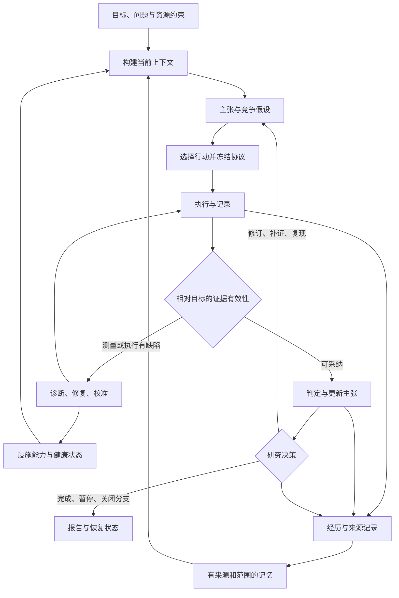

# 自动化科研通式：证据、基础设施与记忆

更新日期：2026-09-12。文档类型：架构设计规范。适用范围：AutoResearch 的研究、独立实验与论文流程。

本文定义自动化科研的状态模型、行动选择、基础设施边界与记忆机制；具体转换和验收要求见[实验循环规范](research-loop.md)。本文描述目标架构，现有实现与待补能力在第 9 节逐项区分；不构成运行时已完成这些能力的声明。通式用于组织系统行为，不承诺自动产生科学发现。

设计依据包括当前仓库实现，以及本地案例 `D:/teskdesk/TEST paper/2026-09-10-failure-aware-memory` 的实验记录。该绝对路径是案例来源，不是系统配置或运行依赖；外部系统能力以文内来源为依据。

阅读顺序：状态与通式 → 三个循环 → 记忆与上下文 → 基础设施 → 追溯与验收。返回[文档目录](../README.md)。

## 1. 自动化科研的基本单位

一次科研动作应当改变一个明确的不确定性，或者恢复获得有效证据的能力。其输出包括：数据、数据有效性、对旧主张的影响、仍然未知的内容、下一动作以及可恢复状态。

最小闭环：

> 问题与约束 → 检索已有证据和经验 → 提出竞争假设 → 选择可区分假设的行动 → 在实际基础设施上执行 → 验证观察 → 更新主张与记忆 → 选择下一行动。

这里的行动可以是读文献、推导、校准、诊断、实验、复现或停止。生成失败报告是一次状态提交；它可以结束一个 attempt、关闭一个假设分支，研究程序仍可以在预算内继续。

必须区分四种结果：执行完成、测量有效、假设得到支持、研究任务结束。一个正常完成且有效的实验可以否定原假设；一个失败的执行也可以为基础设施可靠性研究提供观察。

## 2. 状态与通式

定义持久研究状态：

\[
S_t=(G,Q_t,C_t,H_t,E_t,M_t,I_t,b_t)
\]

| 符号 | 意义 |
|---|---|
| G | 用户目标、研究范围、可用资源、评价与停止约束 |
| Q | 当前待解决的问题与关键不确定性 |
| C | 带版本、适用范围、支持/反对证据的主张 |
| H | 可检验假设、竞争解释及其继承关系 |
| E | 已登记证据及其原始数据、协议、有效性和分析来源 |
| M | 跨调用/轮次可检索的经历、知识、程序和决策记忆 |
| I | 基础设施能力、健康状态、版本与实际资源限制 |
| b | 剩余 token、费用、时间、实验单元与并发配额 |

一次循环分解为：

\[
\begin{aligned}
x_t &= \operatorname{Context}(S_t,\mathrm{role},\tau_t) \\
a_t &= \pi(x_t,\mathcal A(I_t),b_t) \\
(o_t,z_t) &= \operatorname{Execute}(a_t,I_t) \\
(v_t,e_t) &= \operatorname{Verify}(o_t,z_t,\mathrm{contract}_t,\mathrm{claim}_t) \\
S_{t+1} &= \operatorname{Commit}(\operatorname{Update}(S_t,a_t,o_t,z_t,v_t,e_t))
\end{aligned}
\]

`x` 是本次角色看到的上下文包；`a` 是有输入/输出契约的行动；`o` 是观察，`z` 是执行状态和费用遥测；`v` 是相对于目标主张的有效性；`e` 是可采纳证据。contract 在实验中是冻结协议，在文献检索中是来源核验要求，在理论研究中是证明检查要求。Commit 将记录、依赖关系与活动指针一致提交。

关键约束：所有执行和观察均登记；只有通过相应验证的证据才能改变科学主张的支持状态。无效测量仍更新故障记忆和设施状态。Update 可以生成新的待验证假设，但不能把新假设同时标记为已证实。

这也适用于不同科研类型：计算实验的验证器检查协议/统计/复现；仿真检查模型假设与数值误差；理论研究检查明确假设下的证明或反例。具体验证规则由领域适配器提供，LLM 的自评不代替验证器。

## 3. 下一步为什么值得做

行动选择目标是“在剩余资源内，预期能改善研究判断多少”。一个概念性目标：

\[
a_t^*=\arg\max_{a\in\mathcal A_{\rm feasible}(S_t)}
\left[\mathbb E(\Delta U_{\rm knowledge}\mid S_t,a)
-\lambda_{\$}\mathbb E(c_{\$})-\lambda_T\mathbb E(c_T)\right].
\]

可行集合先满足范围、预算、数据使用、实验与设施前置条件；不能通过较高的预期收益抵消这些条件。知识价值包括缩小不确定性、区分解释、发现边界、纠正测量和提高复现可信度。

如果有明确概率模型，可以用期望信息增益等实验设计准则。贝叶斯实验设计提供这类框架，但具体计算也有成本；本项目不要求每个文本假设伪造数值后验。参见 [Modern Bayesian Experimental Design](https://arxiv.org/abs/2302.14545)。

首版采用可审计的定性比较：

1. 当前是什么不确定性或阻塞？
2. 若结果为 A/B/C，各会怎样改变判断？
3. 哪个最小动作能区分这些情况？
4. 它依赖什么设施、数据和先决验证？
5. 预计与实际成本是什么，还有哪些候选因此暂缓？

若不同结果都不会改变结论或下一动作，通常无需执行。修复评分器可以比扩样更有价值；可靠反证可以比继续争取正结果更有价值。

## 4. 三个循环和它们的节奏



图中的每条回边都受预算、幂等性和停止规则限制；再次执行前需核验是否改变协议。冻结实验协议只适用于实验行动；其他行动使用其验收契约。

| 循环 | 可改变的内容 | 典型频率 | 退出条件 |
|---|---|---|---|
| 执行循环 | 环境、脚本、队列、重试、测量设施 | 一次调用到一个 attempt | 可执行且测量可信，或达到修复上限 |
| 科研循环 | 问题、主张、假设、协议及研究分支 | 一个有效观察批次之后 | 问题得到限定回答、分支被否定或暂停 |
| 记忆循环 | 可复用经验、检索索引、适用边界、程序版本 | 每次提交后整理，跨轮次验证 | 有来源的记录可被正确检索与失效 |

LLM 负责候选解释、设计与文字综合；控制器负责版本、状态转换、预算、权限范围、执行恢复和证据准入。多个角色调用可以由同一个模型完成，角色数不构成可靠性的保证。

## 5. 失败报告的机器语义

FailureAnalysis 应包含：failure_id、attempt_id、protocol_hash、target_claim_version、直接观察、执行类别、有效性范围、诊断候选、所缺证据、受影响记录、建议动作、恢复所需资源。

不能只保存“失败，因为效果不好”。例如：

| 已观察事实 | 可以改变什么 | 不能直接推出什么 |
|---|---|---|
| Provider 返回错误，actor 没有实际执行 | 设施健康、调用诊断、端到端完成率（若协议定义） | 算法机制无效 |
| 同一处理池混入另一个实验臂的材料 | treatment 有效性、受污染数据依赖 | 两个机制没有差异 |
| 有效比较的区间跨越零 | 目前证据不充分，考虑预定补证或新设计 | 两组等效或普遍无效 |
| 正式反证条件成立 | 原假设被否定，收缩或重构主张 | 可以删除旧结果并沿用旧成功标准 |

有效性必须相对于协议和目标定义。若研究的是成本约束下的真实系统完成率，协议内的超时、重试耗尽可能就是结果，不能事后以“基础设施故障”为由删除。预先记录缺失、故障和终止的处理规则，以及各实验臂的发生率。外因故障与处理本身导致的故障分开记录，无法归因则保留不确定性。

若失败报告没有原始数据，导入为未验证的历史记录，下一动作是恢复来源或做诊断；不能直接据其语气写入“已反驳”状态。

## 6. 记忆不是单一存储桶

CoALA 将语言 Agent 描述为模块化记忆、内部/外部行动空间及决策过程的组合。以下划分结合科研追溯需要，是本项目在该思路上的具体设计。[CoALA](https://arxiv.org/abs/2309.02427)

| 记忆类型 | 保存内容 | 写入依据 | 推荐存储与使用 |
|---|---|---|---|
| 约束与意图 | 用户约束、研究范围、允许资源、固定规则 | 明确指令及有来源的修订 | 版本化设置，所有关键调用必带 |
| 工作记忆 | 当前 stage、假设/协议版本、待办、阻塞、预算 | 已提交状态 | checkpoint + 按需构建的上下文 |
| 经历记忆 | 发生了什么、哪次实验、错误、观察和决定 | 真实事件与执行回执 | 追加日志，原始产物只存一次 |
| 证据与知识记忆 | 哪个主张在哪些条件下被支持/反对，文献来源 | 可回查证据及审查结果 | 结构化记录 + 派生关系图 |
| 程序记忆 | 可执行分析器、环境配方、诊断脚本和校准流程 | 成功执行、测试、适用条件 | Git 版本化代码/recipe 和验收记录 |
| 决策记忆 | 为什么选本实验、为什么放弃其他解释、何时重开分支 | 决策及所引用状态 | decision log 和问题索引 |

“失败”是经历或证据的属性；“教训”是对经历的解释。单条反思可以作为诊断候选，经验证后才成为可自动采用的程序或规律。Reflexion 展示了以文字反思改善后续尝试的方法，它本身不保证反思内容为科学事实。[Reflexion](https://arxiv.org/abs/2303.11366)

程序记忆应尽可能关联实际脚本和测试。Voyager 使用可执行代码技能库保存与检索行为，这为可验证程序记忆提供了参考；其 Minecraft 结果不直接证明科研工作流有效。[Voyager](https://arxiv.org/abs/2305.16291)

### 6.1 每条记忆的契约

最少字段：

- identity：id、type、version、content_hash、project/run/branch scope。
- content：observation、interpretation、recommended_action，分开存放。
- provenance：source_ids、source_hashes、protocol/snapshot、created_at、derived_from。
- applicability：领域/任务/模型/工具/数据版本条件及 does_not_apply_when。
- assessment：candidate/validated_in_scope/disputed/superseded/invalidated，以及核验方式、支持和反证。
- dependencies：依赖的证据、代码与配置，recheck_after 或显式失效触发器。
- access：哪些角色、项目和实验 split 可以读取。

可靠性记录证据类型、独立性、样本与复现范围；LLM 给出的 confidence 不能充当校准过的概率。

### 6.2 写入、巩固、失效与遗忘

经历先追加登记；抽取出的经验进入 candidate。去重合并索引、保留来源，不丢弃重复执行的成本与不同结果。经领域核验或工程复现后，成为 validated_in_scope。新反证到来时进入 disputed/invalidated 或收缩适用范围，向依赖的摘要、检索缓存与报告传播失效。

热上下文、缓存和向量索引可以淘汰；原始证据和决定按明确保留策略归档，不能因为“不常用”或“结果为负”删除。临时健康状态会过期；已发生的历史观察不会因为过期变成没发生。

失效可能表示“已证明错误”“被新版本替代”或“现在不可用但历史仍有效”，必须区分。由错误评分器派生的结果需要重新审查；旧工具版本的正确 recipe 则可以继续作为历史经验。

### 6.3 记忆检索的顺序

1. 先按权限、project/branch/split、有效性与版本过滤。
2. 精确匹配当前 claim/hypothesis/protocol、故障代码和依赖对象。
3. 补齐反证、适用边界、禁止复用条件和未决冲突。
4. 使用关键词/全文搜索召回相关经验；语义检索只扩展候选。
5. 按适用性、来源可靠性、决策相关性与成本排序。
6. 构建可追溯上下文包并记录被选/未选原因；没有适用经验时允许 abstain。

不将“语义相似”解释为“同一机制”，不将检索命中解释为事实成立。首版采用 id/关系与关键词检索即可；有评估证据证明召回不足后再增加 embedding 或独立向量服务。

## 7. 上下文是记忆的一次有界读取

持久记忆可以很大，单次上下文有容量上限。每次调用只读取完成当前决策所需的最小依赖闭包，并用结构化摘要代表不必全文读取的历史。

建议包结构：

```text
任务身份：project / run / branch / cycle / role / stage
固定约束：用户目标、可用资源、冻结的规则
当前状态：活动主张/假设、协议版本、snapshot、预算
证据：直接观察、反证、测量有效性、冲突与出处
经验：适用的工程或科研经验，附适用范围
行动契约：本次允许改变什么、必须输出什么、如何验收
检索凭据：可按需读取的 artifact ids 与行范围
```

构建顺序应保证固定约束、当前协议与关键反证完整，然后分配补充证据和历史记忆。长度预算包含系统提示、工具 schema、检索内容、工具回执与输出预留；记录 token 计数来源和估算误差。

优先按完整记录选取，再做有来源的摘要。摘要不能吞掉分母、区间、否定条件或冲突。若必要记录仍无法放下，分阶段查询或返回 context_insufficient，不裁断后让模型猜。

上下文 manifest 保存所有输入记录的版本/hash、选择理由、压缩版本、被省略范围和预算。任何源记录失效都使相应摘要与包失效。

## 8. 两套记忆和数据曝光登记

当前研究涉及 Agent memory，需要明确：

- 科研系统记忆：帮助设计、执行、诊断和判断实验。
- 被测 Agent 记忆：实验自变量的一部分，其内容、构建、检索与更新规则受实验协议控制。

给科研系统补入旧结果，不能自动给某个被测 Agent 增加同样信息。被测记忆池必须记录 hash、来源 split、实验臂、构建脚本和可见范围。不同实验臂用同一基础设施版本，但工作目录、会话、缓存和记忆命名空间按协议隔离。若研究对象就是在线学习，则冻结的是更新算法、可用反馈和时间顺序，记录每一步 memory version。

每个派生假设记录 `discovery_source_ids`；每个数据集记录被哪些角色、prompt、摘要、embedding 和实验设计使用。检索和总结也构成数据曝光，换一个文件名不能恢复独立性。

旧测试集参与形成新假设后，对这次新验证已不是未见数据。新 seed 只引入随机重复，不会消除在相同题目上选假设带来的适应性偏差；正式泛化结论需要与目标一致的独立样本，或事前定义的有效自适应分析方案。[Generalization in Adaptive Data Analysis and Holdout Reuse](https://arxiv.org/abs/1506.02629)

控制边界不能仅是 prompt 或 cwd；需要执行器实际限制可读写目录、工具和挂载。评估答案只暴露给评分器。若当前执行环境不具备该隔离能力，能力登记标记未验证，不能声称完成了盲测。

## 9. 基础设施登记：先知道实际能做什么

每个设施适配器登记：capability_id、作用、版本、配置指纹、输入输出契约、数据/网络/设备范围、并发和配额、可复现信息、probe 结果/时间、取消与恢复方式。凭据只保存引用。

状态区分：discovered（找到命令/代码）、configured、probed、available、degraded、unavailable。状态不能从名称推断：找到 docker CLI 不等于 daemon 可用；找到模型 route 不等于请求成功或能力已经验证。

选择实验前，根据所需设施做最小预检：实际执行器是否可用，数据与环境是否匹配，评分器能否区分正负控制，成本估算是否来自当前执行器的观测。I 是循环状态的一部分，不是启动时的一段静态文字。

### 9.1 当前项目已有的基础

本次核验为源码/文档读取及本机命令发现，没有做线上模型、Docker daemon 或集群 smoke test。

| 能力 | 已有实现/证据 | 当前边界与设计补充 |
|---|---|---|
| 角色执行与会话恢复 | [subagent-provider.ts](../../packages/autoresearch/src/providers/subagent-provider.ts)：DSH runtime、任务指纹与持久 child registry | 复用；role-task 指纹不等于完整科学协议/数据指纹 |
| 研究/实验流程 | [research runner](../../packages/autoresearch/src/service/runner.ts)、[experiment runner](../../packages/autoresearch/src/experiment/runner.ts) | 共用证据判定和修订步骤，保留 minimal 与 legacy 模式 |
| 状态和事件 | [state.ts](../../packages/autoresearch/src/core/state.ts)：state.json、事件追加 | 增加统一提交身份与恢复核验；当前 state/event 写入不是跨文件事务 |
| 研究树/假设索引 | [research-tree.ts](../../packages/autoresearch/src/core/research-tree.ts)、[hypothesis-pool.ts](../../packages/autoresearch/src/core/hypothesis-pool.ts) | 增加版本化 claim/hypothesis/evidence 关系，聚合冲突 |
| 失败保存 | [failure-reflexion.ts](../../packages/autoresearch/src/core/failure-reflexion.ts) | 增加结构化分类、作用范围、验证与下一动作；Markdown 是派生展示 |
| 上下文控制 | [policy/context.ts](../../packages/autoresearch/src/policy/context.ts)、provider 的输入组装 | 已有预算/不足报错；升级为记录级召回与可追溯摘要 |
| 模型路由与请求账本 | [model-routing.ts](../../packages/autoresearch/src/policy/model-routing.ts)、[request-ledger.ts](../../packages/autoresearch/src/policy/request-ledger.ts) | 已有预留、结算和 usage 来源；另接实验内部运行成本，避免漏计或重复计费 |
| 文献知识结构 | [knowledge-graph.ts](../../packages/autoresearch/src/brainstorm/knowledge-graph.ts)、wiki renderer | 现有文献/方向图；需桥接主张与实验来源，不能直接作为因果证据图 |
| Worker 产物检查 | [validation.ts](../../packages/autoresearch/src/experiment/validation.ts) | 当前核验形状、存在性和 run-root 包含关系；科学有效性需要领域验证器 |
| 论文与交互 | [checkpoint.ts](../../packages/autoresearch/src/paper/checkpoint.ts)、[autoresearch-web](../../packages/autoresearch-web/README.md) | 复用恢复与工作台；报告统一绑定已提交 snapshot |
| 可选模型接入 | [dsh-cpa](../../packages/dsh-cpa/README.md) | 原生 route 配置接入，非第二套 runtime；本次未验证 endpoint |
| 本机执行工具 | 发现 dsh、Python、uv、Node、Git、Docker 命令 | 只说明命令存在；实际资源、权限、服务与健康状态仍由 probe 登记 |

因此首版可以由 DSH + 现有 runner + 文件工件完成核心闭环。新增的核心是证据契约与记忆治理，而非重新搭建 Agent runtime。

### 9.2 可选基础设施及引入条件

| 需要解决的问题 | 可复用基础设施 | 接入条件与边界 |
|---|---|---|
| 单机可回查事实与索引 | JSONL + 原子 snapshot + 单写者；后续可加 SQLite | 先沿用文件模型；新增索引可重建，保持唯一事实源 |
| 大数据与可重建步骤的版本 | Git 管代码；按需引入 DVC | 大产物/跨机器协作出现后接入，依赖/输出 hash 与 protocol 关联 |
| 大量 run 的参数、指标、产物比较 | MLflow Tracking | 有集中查询需求时同步；正式判定仍由本项目协议和证据审查决定 |
| 计算与流程的来源追踪 | 借鉴 AiiDA 数据/逻辑 provenance | 首版实现必要关联；只有进入复杂科研计算平台时再评估运行时接入 |
| 更复杂的跨机器持久调度 | 作业后端适配器；可评估 LangGraph 持久化等 | 已有 DSH 恢复优先保留；任务规模要求才替换/扩展，不能双重调度同一任务 |
| 长期记忆跨项目搜索 | 关系/全文索引，必要时再加向量召回 | 先具备来源、权限、失效传播和召回评估，向量服务只提供候选 |

DVC 的 pipeline/lock 记录依赖与输出变化；MLflow Tracking 记录 run 的参数、代码版本、指标与产物。它们可承担数据与实验记账，不能自动决定某主张科学上成立。[DVC pipelines](https://doc.dvc.org/user-guide/pipelines/defining-pipelines)，[MLflow Tracking](https://mlflow.org/docs/latest/ml/tracking/)

AiiDA 区分数据来源与流程逻辑来源；本设计据此分别记录“数值如何产生”和“为何选择这个实验”。这属于设计借鉴，完整追溯也不保证外部 API 永远返回相同结果。[AiiDA provenance](https://aiida.readthedocs.io/projects/aiida-core/en/stable/topics/provenance/concepts.html)

LangGraph 文档区分线程 checkpoint 与跨线程 store；这支持恢复状态和长期记忆分层。它是可替代的编排基础，不是本次必须安装的组件。[LangGraph persistence](https://docs.langchain.com/oss/python/langgraph/persistence)

## 10. 长任务、资源与复现契约

每个 job 保存 job_id、claim/hypothesis/protocol、attempt、执行后端 id、workspace、代码/数据/环境/treatment/model 指纹、输入快照、预算预留、开始/结束状态、产物摘要、退出码和错误类别。

在支持的后端增加 heartbeat/lease、取消和回收能力；恢复时先查询已有 job，不能因为对话断了就启动同样的付费实验。只有确认 job 状态和产物身份后才复用。后端无法确定是否已执行时记录 unknown，避免假装提供 exactly-once 执行保证。

两个预算层必须关联：外层科研编排消耗，内层被研究系统的完整执行消耗。总账基于实际请求/作业身份去重；包括重试、cache input、output、时间和可得计价依据。未知费用必须保留 unknown，不能当零。新建假设分支和重新开始 session 均不清零科研程序预算。

复现指纹包含研究对象的模型、工具 schema、系统 prompt、记忆算法/内容和数据 split；更换底座后旧数据保持原标签。外层分析角色的模型版本也登记，但不机械认为所有外层模型变更都会改变被测 treatment；按实际依赖判断。

源数据追加期间，分析先固定行清单和内容 hash，再产出数字。报告与图表只引用该 snapshot；新行产生新 snapshot，不覆盖已提交结果。

## 11. 单一事实源与关系图

新增结构不应再引入互相争夺权威的“第三个记忆库”。建议将版本化记录和提交 journal 作为统一事实来源，ResearchTree、HypothesisPool、文献桥接图、向量索引、HANDOFF 与报告都是可重建视图。

每次迁移记录 legacy 来源。已有研究树节点并不天然是有效科学事实；必须具备相应证据与判定。旧[假设池设计](../archive/designs/2026-08-15-hypothesis-local-pool-design.md)的 DRAW/LOSS→REFUTED 规则不适合新通式；新设计以预定判定规则、区间与有效性为准。这是需要在实施时显式替代的语义，不是已修改的运行时行为。

关键关系：motivates、tests、produces、supports、refutes、qualifies、invalidates、derived_from、supersedes、used_memory、exposed_to。

科学探索可以反复循环；按版本展开的数据生成链仍可追溯到先前输入。反对证据不会因重开分支而消失，报告必须能回查“主张版本 → 判定 → 分析快照 → 原始行 → 执行 → 冻结协议”。

## 12. 从 TEST paper 得到的具体下一步

将当前数据快照导入时，先建立证据卡，注明只是读取了报告、尚未独立重算。A2−A1 未提供明确正向支持、预算门槛未通过以及重复冲突，应分别登记；不能合成一句“失败记忆已被证伪”。

推荐次序：

1. 核验 protocol/treatment 与原始数据身份，定位重复冲突及缺格的准确范围。
2. 确认评分、实验臂区别和预算统计有效；按预定规则修复或重跑受影响部分。
3. 用有效观察生成有限个竞争解释：相关性不足、经验内容不正确、剂量/成本混杂、收益只在某类任务出现。
4. 为各解释写出会改变判断的观察；优先选择成本低且能排除至少一个解释的诊断。
5. 对选定新假设冻结新的数据/协议/被测记忆策略，在未参与该假设选择的数据上验证。
6. 将成功、失败和边界结果同时写回知识记忆；经工程验证的诊断程序写回程序记忆。

[实验循环规范](research-loop.md)第 5 节的 H1/H2/H3 可以作为候选，不能保证某条会成立。若结果一直不支持原主张，产出有边界的否定/未决结论，并转向仍可检验的问题。

## 13. 如何证明记忆和自动循环有用

记忆机制本身需要实验。对同一批未参与设计的研究任务，在相同基础设施与预算规则下比较：无持久经验、仅历史摘要、有来源的结构化证据/经验、再加入经验证的程序记忆。

固定各配置可用的原始信息或明确承认信息量是变量；比较完整运行成本，覆盖重复种子，并预先确定主指标。评估至少包括：

- 无效主张率：支持状态缺少可采纳证据或违反协议的比例。
- 失败重复率：已知适用故障在后续再出现的比例。
- 诊断与恢复成本：获得下一个有效实验的费用/时间。
- 记忆误用率：范围、版本或 split 不适用仍被采用的比例。
- 反证召回率、来源追溯完整率与数据曝光违规数。
- 同预算下问题解决质量，以及独立复现结果。

晋升记忆的策略也要版本化。评估新检索/总结策略时，冻结旧版本为基线；在分开的评估分支测试。策略改进不能悄悄修改正在进行的正式实验或用户约束。

## 14. 对后续实施的收敛

第一批实现聚焦共同证据/修订步骤、版本与来源契约、角色上下文包、双 runner 接入和恢复一致性。使用现有设施完成一个可验证闭环。

第二批补充记忆抽取、适用性检索、程序记忆与失效传播，使用上述对照验证收益。

第三批仅在可观测瓶颈出现时接入集中 tracking、数据版本、全文/向量服务或远程作业系统。

这三个实施批次是模块边界，科研流程不要求固定数量的 Agent。实现完成依据为[实验循环规范](research-loop.md)第 9 节的验收条件，以及本文第 13 节的记忆机制评估。
