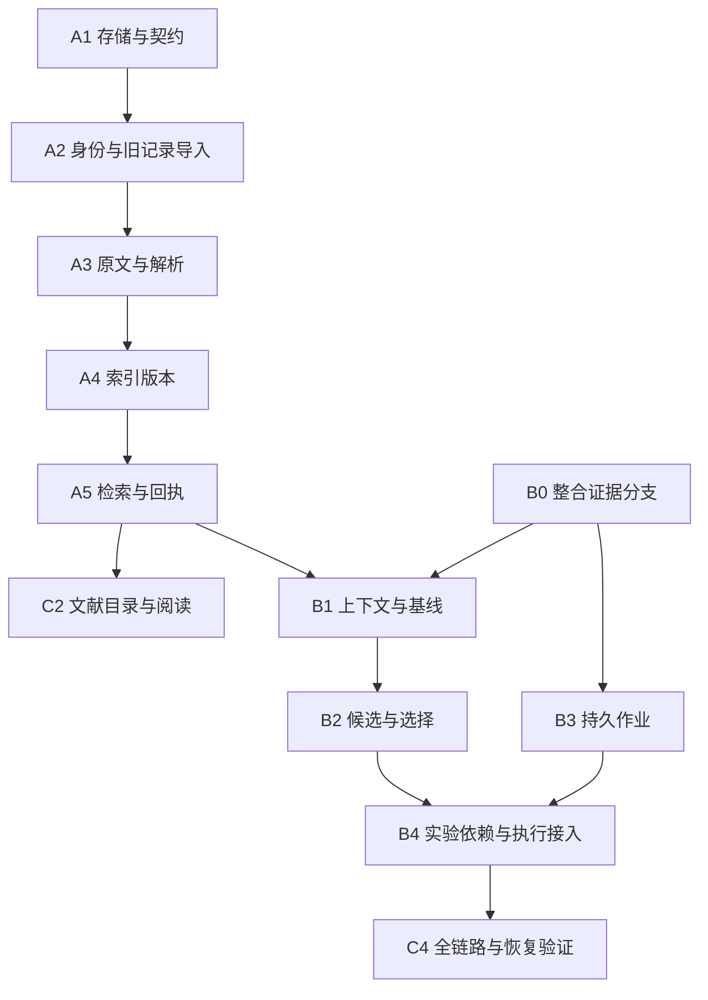

# AutoResearch 文献 RAG、研究闭环与长程运行 Implementation Plan

> **For agentic workers:** REQUIRED SUB-SKILL: Use subagent-driven-development (recommended) or executing-plans to implement this plan task-by-task. Steps use checkbox (`- [ ]`) syntax for tracking. 本仓库可用技能名不带 `superpowers:` 前缀；执行时按实际技能目录加载。

**Goal:** 让已搜索论文成为有原文出处、可检索的研究输入，并让实验结果驱动的新假设能够在中断后继续执行。

**Architecture:** 文献 registry 管外部资料，ResearchStore 管科研判断，job store 管执行；三者通过不可变 ID、hash 和 manifest 关联。保留统一 ResearchTree，增加文献检索与作业视图，不另建相互覆盖的假设树。先交付本地关键词 RAG，再整合证据分支、阅读界面和恢复能力。

**Tech Stack:** 现有 TypeScript/Node ESM、`node:test`、React/PDF.js；本地 `node:sqlite`/FTS5 与按 hash 存储的原文；PDF/HTML 解析采用显式 adapter。

## Global Constraints

- 本文件状态：**本轮范围已实现并完成软件验收**。用户已授权多 agent 实现；在隔离分支执行，不自动合并。用户后续已允许付费模型调用，沿用项目配置与预算；benchmark 仍暂缓，完整真实模型论文和 24 小时运行未验收。
- 最新范围调整：用户要求 benchmark 暂时不管。C1、C3 及研究性能对照暂缓，不准备试点数据集或运行 benchmark；保留必要的软件正确性、隔离和恢复测试。
- 保持当前包约束 `node >=22.19.0`、`dsh >=0.1.5-alpha.1`；最低版本和实际运行版本分别验证。
- 当前源码和未提交工作都属于基线；实施前建立隔离工作区，不覆盖用户改动。
- main 与 `feat/evidence-driven-research@5034eb1` 的职责不同；分支能力经 B0 整合验收后才可使用。
- 文献是 `author_reported`，引用成立不等于独立复现；工程失败不等于科学反证。
- 正式 hidden test 不回流到下一假设；角色、project、run、split 边界适用于检索、缓存和模型调用。
- 任何外部请求、模型使用、作业提交均经过现有授权和预算规则；本计划不是新增无限资源授权。
- 只声明经过测试的恢复语义；无回执的外部提交保持 unknown，不承诺远程 exactly-once。

---

## 1. 计划入口与范围

依据：[根待办](../../../TODO.md)、[RAG 设计](../../../research/2026-09-16-autoresearch-review/rag-design.md)、[整体改造方案](../../../research/2026-09-16-autoresearch-review/proposal.md)。

拆成三个可单独交付的子项目：

| 子计划 | 可交付结果 | 详细任务 |
|---|---|---|
| [A：文献目录、入库与检索](2026-09-16-rag-foundation.md) | 命令行导入文献、构建索引、检索并回查出处；可独立使用 | A1–A5 |
| [B：研究接入与长任务](2026-09-16-rag-research-runtime.md) | 实验反馈 + 文献生成候选；持久作业、预算和恢复 | B0–B4 |
| [C：阅读界面与可靠性验证](2026-09-16-rag-evaluation-workbench.md) | 文献阅读入口、全链路与恢复测试 | C2、C4；C1/C3 暂缓 |

正文保留实施时的目标契约；A1–A5、B0–B4、C2 及已有项目流程现已实现并通过独立复审，C4 实际两小时运行已核验通过。当前可用入口、已执行验证及代码版本边界见[验收记录](../../verification/2026-09-16-research-rag-runtime.md)。根目录没有 package.json，命令必须在对应 package 下运行。

## 2. 已作出的技术选择

### 2.1 存储与检索

首版使用项目级 `.autoresearch/literature/catalog.sqlite` 保存文献事实，原始文件写入 `objects/<sha256>`。每个索引 generation 有独立、只读发布的索引文件；旧研究继续引用旧 generation。科研判断仍写现有 ResearchStore；job 数据单独放 `.autoresearch/runtime/jobs.sqlite`。

选 SQLite 是为了在身份映射、索引发布、领取和预算更新中使用事务；不引入独立数据库服务。检索采用 FTS5/BM25。中文先使用固定版本的字符 unigram/bigram 预切分作为可重现基线，同时保留英文词和数字；这不是宣称已解决中文语义检索。

当前机器实际为 Node `v24.4.1`，内存探针确认 SQLite `3.50.2` 和 FTS5 可用。**已验证 Node 22.19.0 构建、FTS5、文献模块及 Windows 作业恢复测试。** 最终集成仍须重新验证；`node:sqlite` 在最低版本仍处 active development，避免使用该版本文档之外的新 API。[Node 22.19.0 文档](https://nodejs.org/download/release/v22.19.0/docs/api/sqlite.html)

数据库连接留在独立 worker 内，外部异步访问；事务内不等待网络或模型。WAL 数据库只放本机磁盘，首版不支持网络共享盘上的多机写入。备份使用 SQLite 一致性机制或关闭连接后备份，不能只复制正在写入的主数据库文件。[SQLite WAL](https://www.sqlite.org/wal.html)

### 2.2 解析

先交付 UTF-8 纯文本/Markdown 与结构化 HTML，再交付数字 PDF；结构化表格保留行列标题、单位和脚注。数字 PDF 首版只接纳可核对的文本页；无法可靠恢复的表格/公式/扫描页报告解析缺口。Docling/GROBID/OCR 不作为简单 RAG 的启动依赖，作为同一 parser 接口的后续实现。

### 2.3 并发与选择

候选可以保留多个，昂贵实验并发默认 1。先保证提交、收集、验证、结算可以恢复，再增加实验并发。候选排序采用可解释规则，不使用未经校准的 LLM 自报成功概率。

### 2.4 兼容方式

当前新增 `literature.mode = off | lexical`，默认 off；hybrid 随 C3 暂缓，暂不暴露不可用设置。旧 `PaperRecord` 和 wiki 继续可读；新目录保存规范资料，旧格式作为导入/导出兼容层。旧记录没有可核对出处时标 `legacy_unverified`，不能批量升级为可信原文。

## 3. 依赖与推荐交付顺序



| 批次 | 内容 | 完成时用户能做什么 | 进入下一批的条件 |
|---|---|---|---|
| 1 | A1–A5 | 导入论文、检索原文、查看来源和未知项 | 同一索引结果可重放，来源/作用域/中文短查询用例通过 |
| 2 | B0、B1 + C2 | 在研究中使用文献，并从目录打开证据段落 | 四条既有研究路径不回归，新假设可追踪来源 |
| 3 | B2–B4 + C4 | 多候选选择、长实验脱离模型调用运行、重启后接管 | 故障注入证明不错误重提、不重置预算、不污染科学判断 |

C1/C3 保留历史设计但不安排实施，也不作为以上批次的前置条件。C2 不必等待 B3。多人并行时各自负责新增目录；`settings/schema.ts`、`index.ts`、runner 与 package 文件由单一集成人统一修改。

## 4. 数据流与职责

```text
搜索回执/本地登记
  → Work + DocumentVersion + 原始字节
  → SourceSpan + 解析质量报告
  → IndexGeneration
  → RetrievalReceipt（检索候选）
  → ResearchContext（实际入 prompt 的片段与内部观察）
  → Candidate（父版本、实验证据 ID、文献 span ID）
  → SelectionDecision → Protocol + TaskGraph
  → Job → ArtifactManifest → Evidence validation
  → ResearchStore successor/revision → 下一轮
```

三类成功分别记录：job 成功表示程序结束；evidence valid 表示结果通过规定验证；hypothesis supported 表示冻结规则允许该科研判断。任何一类都不自动替代另外两类。

## 5. 跨模块验收场景

1. 同一论文从 DOI、arXiv v1/v2 和旧 wiki 导入：保留身份关联与版本差异；标题碰巧相同的不同论文不误合并。
2. 询问只存在于方法节/表格的数值：必须给到对应位置；仅有摘要时返回缺口。
3. 有支持与反对结果：prompt 同时带入，窗口不够则明确失败，不静默丢弃反证。
4. 一次有效阴性结果产生新候选；一次 OOM 只产生修复诊断；新假设没有继承父假设的“已验证”状态。
5. 入库或索引中途退出：当前 active generation 完整可用；恢复只重做指纹变化/未完成步骤。
6. 实验提交后控制器退出：恢复先 inspect；unknown 不重提；已完成结果只准入一次。
7. run 使用 G1 后文献库发布 G2：恢复仍用 G1，显式更新才使用 G2；撤稿/访问撤销事件仍被处理。
8. hidden test 标签或评分资料试图进入 RAG：在入库/授权边界被排除，embedding、rerank、缓存同样不可见。
9. 阅读 PDF：只读已登记版本，不隐式下载、解析、建索引或启动实验。

## 6. 验证命令与报告规则

核心包工作目录 `packages/autoresearch`：

```powershell
npm run typecheck
npm test
```

单任务默认先构建，再运行该任务测试，禁止使用旧 dist 掩盖源码失败：

```powershell
npm run build
node --experimental-strip-types --test test/unit/literature-identity.test.ts
```

Web 包工作目录 `packages/autoresearch-web`：

```powershell
npm run build
npm test
npm run test:workbench:browser
```

新增 Web 测试必须加入其显式 `test` 脚本；核心包脚本会自动发现 unit/integration 的 `.test.ts`。每一批完成后执行相应包的完整检查，未涉及 UI 的任务不用反复跑浏览器。

软件验证记录 commit、资料/索引版本、环境、故障注入点、预算和原始日志。mock、确定性 fixture、真实 provider、真实长时间运行分栏；不能用其中一种冒充另一种。当前不生成研究性能 benchmark 报告，也不据这些功能测试宣称科研效果提升。

## 7. 迁移、回滚与交付标准

- 数据库 migration 带单调 schema version；升级前一致性备份，版本过新则只报不兼容，不猜测字段。
- 原文/版本/receipt 不覆盖；新索引发布只切 active 指针。只读历史索引需要的最小 reader 版本写入 manifest。
- 关闭 literature 功能后旧研究流程可启动；已引用新资料的历史结果仍能浏览，不能删除被引用原文作为“回滚”。
- 运行中 job 不因功能开关关闭而被遗忘；先 collect/cancel/reconcile 后停用调度。
- 每个任务提交只包含该任务文件；不自动 stage 整个脏工作区。计划中的提交步骤不是当前已经提交。
- 第一批交付不依赖向量模型、完整图索引或外部研究 benchmark 全量部署。

## 8. 审阅时需要明确的产品范围

本计划给定的默认范围是：项目内共享文献；本机单控制器执行、并发实验 1；关键词默认；公开可访问资料或用户已登记本地文件；Windows 为首要运行环境。多用户/多机调度、跨项目私有库共享、大规模向量服务和扫描论文视觉理解均不列入前三批验收。

实施已按上述依赖完成整合，使用同一 ResearchStore。后续扩展应继续沿用来源、作用域、预算和证据准入边界；C1/C3 需在用户恢复 benchmark 范围后另行开展。
