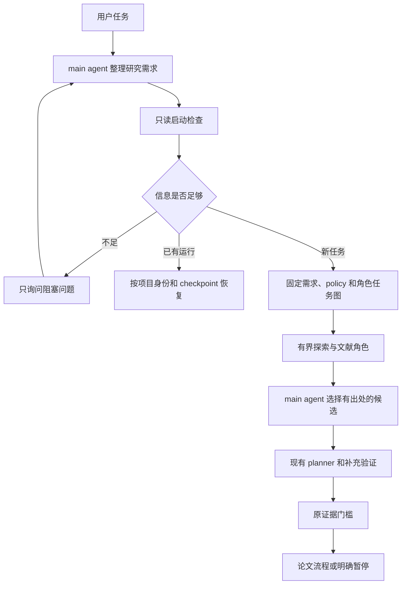

# 启动阶段的 main agent 调度设计

状态：**完整设计作为后续参考；本轮按用户选择仅实施“自动分流与恢复”子集**。用户明确选择：准确选择已有项目、新研究、独立实验或继续运行。对应实施计划见 `../plans/2026-09-17-startup-routing.md`。ResearchBrief 全链路、StartupPlan 角色图、research_dispatch 和额外前置角色暂缓，不能视作已经实现或获准扩展的本轮范围。基线为 `feat/rag-research@6a369f2`。benchmark 继续暂缓，不自动合并主工作目录，也不修改全局 DSH 配置。

## 1. 当前缺口

1. 首轮分流主要是 `presets/auto_research/agent.cordis.yml` 的 persona 指令。已有四类执行入口，但没有统一的启动检查、结构化调度计划或启动状态。
2. `project_paper_run` 没有用户目标/研究重点输入；`project-explorer` 的输入只有 `projectInventory`。`project/discovery.ts` 将候选写成通用的“已有项目生成论文”。用户指定的研究问题、约束和预期交付物没有可靠的传递链。
3. 现有服务具备项目身份、冻结 policy、request ledger、实验图和论文 checkpoint，但 main agent 在启动前没有统一结果说明该恢复哪一步、还缺什么、哪些角色允许调用。
4. `profilePath` 出现在 ResearchRunOptions 和工具参数中，当前研究服务并未消费它，runner 只读取 runDir 下的 PROFILE.md。启动时不能把传入参数等同于约束已经生效。
5. minimal runner 的显式 brainstorm/deepDive 分支位于 durable 恢复分支之前。应针对已完成的启动角色增加恢复回归，避免显式启用这些角色时重复付费。
6. `scripts/start-session.mjs --resume` 仍根据全局 last-run 生成 paper resume 指令，`prompts/session/autoresearch.md` 也未包含新的项目流程。仅更新 preset 会留下另一条旧的启动路径。

以上结论来自当前源码检查，不是新的端到端验收结果。已有 venue 等 paper options 继续保留，缺口主要是研究问题和用户约束。主工作目录仍是旧入口，本设计针对包含上一轮成果的隔离分支。

## 2. 方案选择

| 方案 | 收益 | 限制 |
| --- | --- | --- |
| 仅强化 persona | 改动小，改善分流提示 | 不能保证用户需求传递、重复调用防护和恢复 |
| **main agent + 结构化启动工具（推荐）** | main agent 理解意图，代码核对范围、预算和运行状态；复用已有角色 | 需增加启动契约及持久状态 |
| 新增独立总控模型 | 可以再做一轮任务规划 | 与 main agent 重复决策，增加调用、计费和恢复边界 |

采用第二项。main agent 负责理解用户、提出任务安排及选择候选；启动服务负责验证计划并通过现有 RoleAgentProvider 执行，所有研究角色使用同一 run ledger。插件加载不启动任务，不额外调用一个“总控模型”。

## 3. 启动流程

### 3.1 保存研究需求

新增版本化 `ResearchBrief`，至少包含：

- `requestText`：main agent 转交的用户请求文本，注明来源为 main-agent-transcribed；未对照宿主消息验证时，不宣称是宿主认证的原始消息。
- `objective`、`focus`、`expectedOutput`（paper / experiment-report / research-report）。
- `intent`（project-paper / research / experiment / resume）；无法确定时返回澄清项，不用关键词规则猜测。
- `projectDir`、指定的 `runDir`、已有材料引用，以及用户明确提出的约束。
- `successCriteria`、明确排除的工作、论文选项。
- 用户表达的预算约束及其与有效 policy 的对应关系；未知货币成本保持 unknown。

需求区分用户明确要求、main agent 的解释、尚未确定的信息。研究重点为空并不总是阻塞：用户明确要求“从整个项目发现贡献”时，可以按该目标探索。

首次实际执行时保存 `input/research-brief.json` 和 hash；后续启动任务、项目发现和候选记录绑定该版本。探索不能覆盖用户目标。简要需求作为必需上下文进入 project-explorer、planner 和论文角色，源码与文献仍作为带出处的不可信资料。

`profilePath` 在新运行中解析、捕获并核对实际生效的 PROFILE 内容；恢复时使用冻结副本。改变目标或必要约束必须产生显式新版本/重新规划，不能静默覆盖旧协议。第一版对已经开始实验的运行拒绝就地替换需求，返回需要新运行的原因。

### 3.2 只读启动检查

新增 `research_prepare`，由 main agent 在明确有研究任务后调用：

- 解析当前 session 工作目录与显式项目路径，禁止回退到插件安装目录。
- 核对请求类型、必要输入、项目路径、指定运行的项目身份和 workflow。
- 读取允许返回的设置字段、冻结 policy、现有状态和 checkpoint。不要读秘密文件，也不要把任意配置原文回传模型。
- 新任务检查运行目录是否已被占用；resume 必须选择具体运行，不用全局 last-run 指针代替项目身份。
- 只返回项目材料覆盖概况；实际源码快照复用现有受限 inventory，在执行阶段创建。
- 汇总已知能力、缺失前置条件、有效角色/token 预算，以及模型路线是否继承。配置存在不代表真实可用性探测通过。

runDir 可以是项目内独立的 `.autoresearch/runs/<id>` 子目录；禁止与项目根相同或成为项目根的祖先，避免将项目源码作为研究输出根。枚举已有运行只检查当前项目登记目录内有上限的状态/身份元数据；旧的外部目录须由用户或已绑定 session 明确提供，不递归扫描整个文件系统。

返回 `ready / needs-input / blocked / resumable / terminal`、理由、需澄清项和建议的下一步。`research_prepare` 不创建 run、调用模型、启动实验、下载文献或更改设置。

本地执行权限缺失不阻止用户明确请求的只读探索，但不得报告“已经具备完整论文验证条件”；进入实验前仍由现有授权检查阻止执行。预算为零时可做只读检查，不启动收费角色。

### 3.3 main agent 制定启动角色任务图

新增 `StartupPlan`，描述 `taskId / role / dependsOn / purpose / inputRefs / expectedOutput / required / status`，并绑定 briefHash、project identity 和 policyHash。它只负责进入研究循环前的角色工作，不复制现有实验 Job 图。

第一版限定角色和执行顺序：

| 任务 | 角色/执行者 | 依赖与条件 |
| --- | --- | --- |
| 项目事实与候选贡献 | 现有 project-explorer | 已有项目路径；受限快照；不执行代码 |
| 相关文献与研究缺口 | 现有 paper-survey | 目标明确，policy 允许，可访问来源；可选 |
| 选择候选与理由 | main agent | 必需探索任务已有有效回执；只能选择已登记候选 |
| 形成实验协议 | 现有 planner | 候选、必需来源与用户约束齐备 |
| 运行补充验证 | 原研究/实验引擎 | 沿用实验授权、预算、验证器和证据准入 |
| 论文生成 | 原论文流程 | 原证据门槛及用户产出要求满足 |

项目探索与仅依赖研究需求的文献探索可以独立执行；需要代码发现结果才能确定问题的文献任务必须声明依赖。只有两者均独立、预算预留通过且 policy 明确允许时，启动角色并发上限才为 2；默认串行。实验并发仍为 1。

minimal 模式不因为存在启动层而自动启用可选 survey/deep-dive。必需任务优先预算准入，可选任务不足时跳过并写明原因；必需任务不足时暂停。主 agent 不能通过原生 subagent 工具绕过研究角色账本。

启动阶段的只读角色不继承 shell 或写文件工具；第一版 survey 优先消费已登记、授权的文献上下文。缺少资料时报告覆盖缺口，不能将一次模型推测标为已完成文献检索。在线获取需要明确的只读工具权限和既有来源登记流程。

### 3.4 有界推进与持久状态

新增 `research_dispatch`，只推进通过验证的启动计划中的一个就绪批次，或者把已完成启动交给原工作流；不在一次工具调用里无限轮询。

- 新任务由 main agent 提供稳定的 requestId，执行时将它与项目、briefHash、workflow、runDir 绑定。重复 requestId/相同输入复用记录；相同 requestId/不同输入拒绝。
- 默认 runDir 位于项目的 `.autoresearch/runs/` 下，由绑定后的 requestId 确定。明确新任务才使用新 requestId；恢复不能用新 ID 绕过已消费预算。
- 首次发布绑定使用完整字节的排他发布。运行推进有独占所有权；并发的第二个调用返回 busy，不调用第二套角色。
- 保存每个启动任务的输入 hash、固定 taskId、派发状态与完整结果回执。恢复先核对回执，未知派发结果保持 unknown，禁止按超时推断失败后自动重提。
- 启动服务完成任务后可返回 `awaiting-main-decision`，让 main agent 使用候选 ID 和理由提交选择；服务重新核对来源与父版本。
- 交接研究循环时写入绑定记录，复用已完成探索和既有 policy/ledger，不重新调用 project-explorer，也不再跑一套相同的前置角色。

共享初始化不得在仍有启动角色运行时再次调用全量 recoverPending，把活跃请求误标为 interrupted。只有证明旧所有者已经结束后才做恢复核对；未知模型结果继续保留其预算处理和未决状态。幂等保证针对相同 requestId/绑定运行，不承诺自动识别任意两段自然语言其实是同一任务。

startup 状态与 RunState 分开，提供可重建的摘要：当前阶段、完成任务、阻塞原因、剩余研究预算、下一合法动作和相应工具参数。

### 3.5 恢复和用户交互

- 对“继续”但没有明确运行：先使用匹配当前项目的 session 绑定；否则检查项目登记目录，唯一且身份完整的可恢复运行可以续接，多个候选才询问用户。全局 last-run 不能单独构成恢复授权。
- `WAITING`：核对同一运行的持久作业，返回建议检查间隔；不新建运行。
- `PAUSED`：区分预算、执行权限、缺资料、验证器或未知回执，给出可执行的处理建议；不把暂停当完成。
- `COMPLETED/FAILED`：展示终态摘要；除非明确新任务，不再派发。
- 仅研究问题、输入范围、交付目标或约束存在阻塞歧义时询问；不在每个阶段重复确认已经授权的付费调用或补充验证。

不承诺宿主进程退出后 main agent 自动继续思考。已有 detached 作业可继续；重新进入会话后通过持久状态恢复编排。常驻调度器不在本次范围。

## 4. 集成位置

- 新增 `src/startup/{contracts,preflight,store,dispatch}.ts`：启动契约、只读检查、任务回执和有界推进。
- 新增 `src/tools/startup.ts`：两个工具；在 `src/index.ts` 注册，复用 workspace path binding。
- `src/service/autoresearch-service.ts`：抽取可复用的 policy/ledger 初始化边界，接收 brief 和已完成启动的交接；旧工具保持可用。
- `src/project/discovery.ts`、`src/agents/roles/project.ts`、`src/agents/types.ts`：显式传递研究需求；保留 source 校验。
- `src/service/research-context.ts` 与 paper 输入构造：将简要需求作为必需约束，避免被候选或上下文裁剪覆盖。
- `src/service/runner.ts`：已完成前置任务的复用和 minimal 恢复回归。
- preset persona：首次任务调用 prepare；main agent 输出任务安排，再 dispatch；状态驱动后续动作。
- `scripts/start-session.mjs` 和 `prompts/session/autoresearch.md`：统一到相同的准备/恢复语义，移除不核对项目的全局恢复分流。

当前插件 API 没有 first-turn 自动执行 hook；第一轮仍由 main agent 按 persona 调用工具。该方案让调度成为可核验的工具流程，不将提示词描述成宿主保证的自动触发。

第一版不增加模型供应商、远程队列、任意角色插件协议或新的科研验证器。新研究、已有项目和独立实验最终仍进入现有实现；不要在启动模块复写三套 runner。

## 5. 验收条件

1. 两次用户请求研究同一项目的不同重点，project-explorer 的实际最终 prompt 能区分目标；需求在 planner 与 paper 输入中仍可追溯。
2. prepare 在空目录、有项目、已有运行、损坏状态下均不写文件、不调用 provider、不加载 secret。
3. 同一 requestId 重复及并发调用不重复创建运行/调用探索；冲突的项目、需求或参数被拒绝。
4. 不同项目的 last-run 不能影响本项目恢复；缺失或歧义输入返回准确澄清项。
5. 启动探索重启后复用已完成任务；unknown 不重派；角色/token 花费在启动与研究循环之间连续。
6. 可选文献任务被 policy 禁止或预算不足时有明确跳过理由；必需任务不足时暂停，不能挤掉实验预算后假装已具备验证能力。
7. 已有项目历史指标保持未核实，执行失败不等于科学反证，原论文证据门槛不变。
8. 显式启用 brainstorm/deepDive 后恢复既有实验图或论文 checkpoint，不重复完成过的启动角色。
9. 测试覆盖工具注册、native schema、workspace binding、实际 provider prompt、恢复和预算联调；随后核心/Web 回归。付费模型可做有上限的启动 smoke，不把它当完整论文验收。

## 6. 实施顺序与边界

先完成“研究需求全链路传递 + 只读 preflight”，再接“有界角色任务及 main agent 候选决策”，最后接“统一恢复与 preset”。每部分独立回归及复审，最后做整体联调。

研究子角色的 token/role-call 预算沿用既有账本。宿主 main agent 自身的对话调用并未因此自动纳入研究 ledger；应单独标示计量范围，不能据此宣称完整货币硬上限。对宿主无法强制执行的用户约束，返回能力缺口，不用提示词冒充执行保障。

以上为完整设计的边界；本轮实现以启动分流与恢复实施计划为准，验收记录单独说明实际完成的子集。
