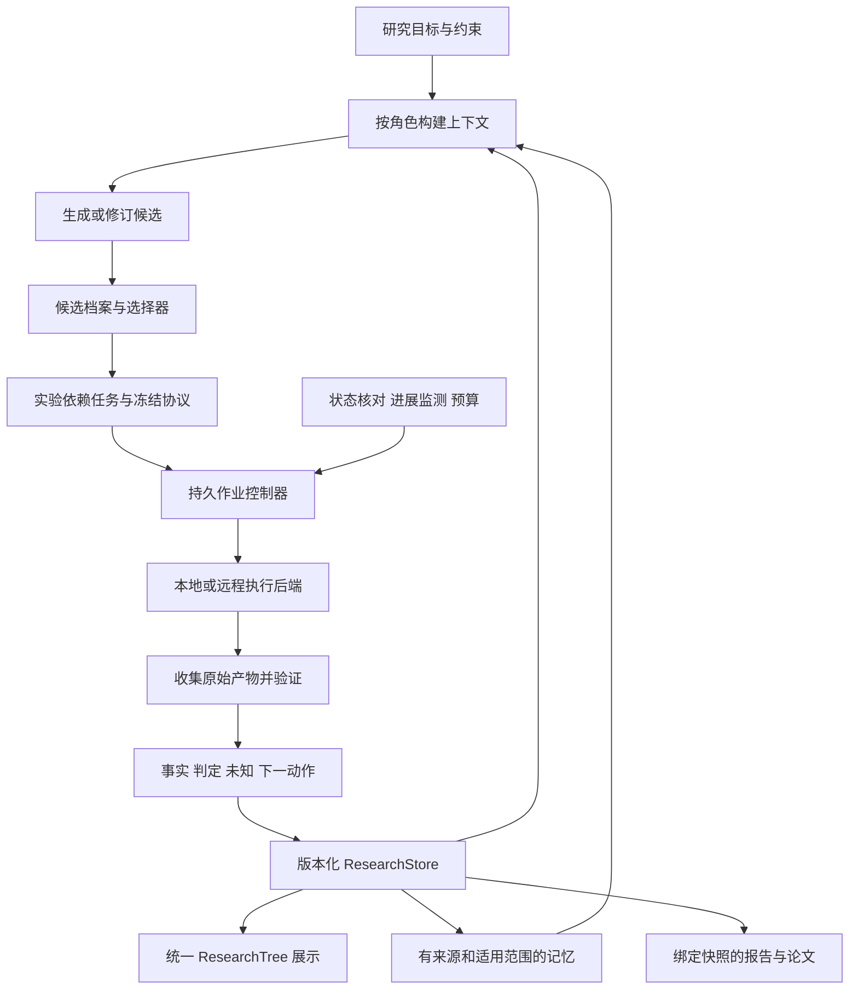

# AutoResearch 改进方案：证据驱动搜索与长程执行

日期：2026-09-16。状态：供审阅的设计建议，尚未实施。基于一手文献阅读、三个子 Agent 专题报告，以及 main 与未合并实现分支的代码检查。

## 1. 结论与基线

继续保留一个统一的 ResearchTree。优先改进它所表达的科学状态、候选选择和执行恢复，而非拆成两棵树。

当前有两个必须区分的基线：

- 当前工作区位于 `main`，HEAD 为 `f415dff`，并有既有未提交改动。这里已有 legacy 结果复盘→洞见→假设生成，但新假设没有自动记录父版本和触发证据；minimal 与独立实验缺少同等闭环。
- `.worktrees/evidence-driven-research` 的 `feat/evidence-driven-research@5034eb1` 已包含版本化科研状态、四路径的证据反馈、完整记录上下文、作用域记忆与恢复保护。它尚未合并到 main。此前关于“当前没有”的结论仅适用于 main。

已核对分支源码及 [实施状态记录](../../docs/autonomous-research/implementation-status.md)。记录中 232 项测试通过是此前的验证结果，本轮未重新执行这些测试，也未据此宣称分支现在可以直接部署。

| 能力 | main 当前代码 | 未合并分支 | 本轮建议的净新增 |
|---|---|---|---|
| 假设演化 | legacy 有文本反馈，新假设缺结构化血缘 | 带版本、来源证据、新协议的修订 | 保存所有竞争候选，支持分支切换与有依据的选择 |
| 科学状态 | tree/pool 的文本与 verdict | ResearchStore 不可变快照，tree/pool 为兼容视图 | 多分支索引与任务依赖，继续复用同一事实源 |
| 证据验证 | 文件形状与路径检查，主要靠 Agent 记录 | 一个可信统计适配器及通用准入边界 | 多产物 manifest、领域适配器、方法实现与主张对账 |
| 上下文/记忆 | 整树 JSON，按预算处理输入 | 完整记录、作用域、反证、冲突与依赖失效 | 大规模检索、工作交接包、可展开摘要、效果评测 |
| 长任务恢复 | 多处 checkpoint 与累计 LLM 预算 | 确认回执复用、unknown 暂停、科学提交恢复 | job 状态查询、自动核对与重新接管、看门狗、跨进程领取 |
| 实验选择 | 顺序循环 | 从最多三个候选中选首个结构合格者 | 比较区分解释的能力、成本和可执行性，保留候选多样性 |

关键代码证据：

- [main 假设生成](../../packages/autoresearch/src/service/steps/idea.ts)：`runIdeaGeneration` 与第 123 行的新增节点。
- [分支科研决策](../../.worktrees/evidence-driven-research/packages/autoresearch/src/service/research-cycle.ts)：第 197–203 行使用 `slice(0, 3)` 和 `find`，不是信息价值排序；第 78–91 行处理 attempt 回执。
- [分支谱系](../../.worktrees/evidence-driven-research/packages/autoresearch/src/research/revision.ts)：当前围绕一个 active hypothesis 做版本演化。
- [分支上下文](../../.worktrees/evidence-driven-research/packages/autoresearch/src/research-context/select.ts)：已有反证、未决冲突和依赖失效处理，不能把这些重新列为从零开发。
- [分支验证器](../../.worktrees/evidence-driven-research/packages/autoresearch/src/experiment/evidence-validator.ts)：可信注册表当前只有 `paired_sign_test_v1`。

## 2. 三种改造路线

| 路线 | 工作内容 | 收益与代价 | 判断 |
|---|---|---|---|
| A：只改 prompt | 增加候选输出字段、失败复盘要求、继续执行指令 | 变动小；难解决持久状态、重复执行和多候选选择问题 | 可作为局部配套，不作为整体方案 |
| B：整合现有分支，再逐步扩展 | 复用 ResearchStore；增加实验候选调度、job adapter、验证与上下文能力 | 与现有结构兼容，能逐项验证，较容易控制成本 | **推荐** |
| C：立即建设分布式科研平台 | 外部工作流引擎、集群队列、多项目调度、集中数据库 | 适合大量远程并发，但部署、迁移及运维成本高 | 先证明有跨机器并发需求后再引入 |

不承诺仅靠整合论文机制就获得更高科学产出。下面的设计与效果目标是本项目的待检验方案。

## 3. 改进一：让下一实验由选择器决定

**问题：** 生成多个候选后选第一条合格者，仍容易在一个方向上反复修补，忽略廉价但能区分解释的实验。

**文献启发：** AI Scientist-v2 的实验树、AlphaEvolve 的候选档案与评估级联、AI co-scientist 的候选比较，以及 IDEAgent 的质量与多样性联合管理。机制细节及限制见[系统报告](scientific-systems.md)、[搜索报告](experiment-search-and-evaluation.md)和[近期论文 R01](recent-papers-and-surveys.md)。

**具体设计：**

1. 每次提交保留全部候选，不只保留被选中的一项；字段包括来源证据、父版本、改变的假设、可观察预测、竞争解释、预期成本、状态与未选择理由。
2. 候选先过可执行性和科学协议约束，再比较“哪个结果能区分哪些解释”“还有哪些关键未知”“与历史是否重复”“成本是否值得”。没有校准数据时用可解释的分项和排序，不把 LLM 自报概率包装成信息增益。
3. 同机制的措辞改写记为已有谱系的新版本；真正不同的机制保留独立 branch。历史被否决的候选可以被新证据重新打开，但须记录理由。
4. 初版保留少量候选，执行并发默认为 1；之后再启用有限并发。候选多样性不要求同时花钱执行所有分支。
5. 保存 `selection-policy version`、参与候选、比较依据、预算预留和选择结果，让同一状态下的决定可回放。
6. 停止原因单独记录：目标验收已满足、预算耗尽、必要输入缺失、没有新的可执行且有区分价值的候选。搜索停滞只表示当前策略下没有进展，不自动证明假设成立或该研究方向无效。

**验收：** 打乱候选数组顺序不会改变确定性比较结果；同一假设换句话说不导致重复实验；新反证能让系统切换到之前保留的分支；允许为了区分解释而选择预期分数不最高的实验。

## 4. 改进二：把实验拆成可验证、可恢复的依赖任务

**问题：** 一个 worker 调用覆盖环境准备、主实验和分析，恢复粒度太粗，也不利于独立核对正式协议是否真正执行。

**设计：** 在现有 protocol 下新增 task items，每项声明前置条件、输入指纹、执行命令/执行入口、输出 manifest、验收规则与预算。参考 FARS 的计划分解和 AlphaEvolve 的分层评估；针对本项目形成如下可裁剪依赖链：

```text
环境与数据核验 → 基线 smoke → 候选开发实验
                                 ↓
                   正式协议与数据使用规则冻结
                                 ↓
                   正式实验 → 独立复验 → 汇总
```

各任务有独立 attempt。只重做失效的依赖及其下游；验证通过且输入指纹兼容的结果复用。是否需要独立复验由主张及协议决定，不为每个廉价预检增加完整科研流程。

**关键边界：** 开发阶段的搜索集可以重复使用；正式评价不能变成每轮优化的反馈集。新增 seed 不能自动消除使用同一任务选择假设产生的偏差。资源不足导致数据量、模型组件或正式训练预算改变时，必须创建新协议或明确退回探索阶段，不能沿用旧正式标签。

**验收：** 故意删掉基线、缩减样本或改变主指标会阻止相应正式主张；中断在第 7 个任务后恢复，只运行仍需执行的项；同名路径但不同内容不能被误当缓存命中。

## 5. 改进三：让长任务脱离单次 LLM 会话持续运行

长程科研至少有三个不同节奏：模型进行一次推理、实验程序运行几小时、研究程序持续多轮。模型调用结束不应该意味着实验被取消；控制器重启也不应该意味着重新发起同一实验。

**文献/工程启发：** 长程记忆和 harness 研究说明交接状态的重要性；可靠执行的具体承诺必须由进程/作业后端实现。见[长程专题报告](long-horizon-runtime.md)，其中官方工程文档与论文分开标注。

### 5.1 Job adapter

定义后端能力：`submit / inspect / collect / cancel`。`resume` 仅由确实支持应用检查点的后端声明，不能假设任意 shell 命令可以从中间恢复。

每个 job 保存稳定 job id、attempt id、输入/协议 hash、后端 job id、主机与进程身份、开始时间、最后进展、日志位置、应用检查点、预算、产物与取消回执。作业状态至少区分 queued、running、succeeded、failed、cancel_requested、cancelled、unknown。

### 5.2 恢复流程

```text
加载已提交科研状态
  → 找出未结束 job
  → inspect 后端与持久回执
      ├─ 已完成：校验并收集结果，再提交证据
      ├─ 仍运行：重新连接监控
      ├─ 已失败：按故障类型决定恢复或新 attempt
      └─ 无法确定：保留 unknown，暂停该 job 的重新提交
```

未知 job 可以等待核实；不依赖它的其他已授权分支可继续。只有后端能可靠按稳定 key 查找/去重时才自动补交缺失任务；仅凭本地没有成功记录无法承诺远程 exactly-once。

### 5.3 控制与资源

- 定时记录 heartbeat 和有意义的进展，区分长计算、失联与无进展；看门狗受任务声明的预期阶段时长约束。
- 使用带过期时间的领取记录和单调递增 token，防止旧控制器恢复后与新控制器同时提交。单机首版继续使用轻量存储；跨主机调度再选择合适的外部一致性存储。
- 将累计 LLM 预算扩为 token、费用、墙钟时长、GPU/CPU 占用、并发配额和磁盘。昂贵 job 启动前预留，完成后按回执结算；成本未知时保持未决预留而不是清零。
- `cancel_requested` 不等于已停止；确认后端取消后再释放资源预留。
- 退避重试只用于暂时性执行故障；科学反证应进入假设判断，不是无限重试直到出现好结果。

**验收：** 控制器在提交前、提交后未收回执、收结果后未提交科研状态等位置崩溃，均可恢复；已确认完成的任务不重复执行；远端状态未知时不重复收费提交；两控制器竞争时只有有效领取者可提交；重启不重置累计预算。

## 6. 改进四：按当前任务构造上下文，并能回查完整记录

现有分支已经实现记录级上下文和反证保护，下一步做规模化与交接能力。

每次调用的交接包包括：目标与约束、当前分支/协议/快照、当前任务、已验证观察与未解决矛盾、上一次失败、下一动作的验收条件、剩余预算和可回查来源。由规范状态生成可读 `HANDOFF.md`，不把 handoff 文本变成新的事实源。

保留三种材料：当前必需记录、适用的经验/历史、按需展开的原始日志/文献。新增关键词与语义检索之前先过滤项目、split、协议版本、有效性和权限，随后将相关反证及冲突双方纳入结果。摘要记录 source ids/hashes、范围和未决矛盾；源记录变化使摘要失效。

新增 `context manifest` 覆盖哪些记录被选择/排除、原因、token 估计和上下文 hash。必要记录超预算时分次取证或暂停该决定；不能通过省略反证让模型继续。

**验收：** 在长历史及小窗口中，当前协议与必要反证均被保留；已失效程序经验不再指导执行；用 snapshot 能重建每次 Agent 所见上下文；比较检索延迟、有效证据召回及下游误判率。

### 6.1 结果反馈到 prompt 的示例

下面是建议输入契约的示意，字段不是当前已实现 API。实际记录须包含可回查的 IDs/hashes，数值由原始产物填入。

```text
目标：判断机制 M 是否改善预注册指标。
当前状态：snapshot S12；hypothesis H3/v2；protocol P7。
观察：E18 为通过准入的测量，按冻结规则反驳 H3/v2 的预测。
未知：实验没有测量解释 B 所需变量，不能因此排除 B。
运行故障：attempt A20 因 OOM 无有效测量；不参与科学支持/反驳。
历史：候选 B 尚未测试；候选 C 与已做实验重复。
预算：剩余资源及已预留作业资源。
任务：提出有证据来源的新候选或修订，并说明它能区分哪些解释。
输出：parent_version、source_evidence_ids、changed_assumption、
      prediction、disconfirming_observation、proposed_protocol、
      estimated_cost、alternatives、stop_reason（如适用）。
```

随后校验输出、保留合格候选，再交给选择器。LLM 的新解释先保持候选状态；已有正式结果触发新假设，并不意味着新假设已经得到正式验证。

## 7. 改进五：分别维护科学认识与执行经验

分支已有 observation / interpretation / procedure / decision 记录。净新增是把程序经验真正形成可验证、可复用的执行资产，以及选择经验的效果闭环。

- 科学循环：事实→假设判断→竞争解释→新实验。
- 执行循环：依赖/环境/资源故障→修复候选→受控测试→版本化 procedure。

例如某个 OOM 的修复对当前设备和配置有效，只能提升对应 procedure 的适用性；它不应把“算法机制不成立”写入科学记忆。每项可复用程序保存代码 hash、环境约束、测试入口、适用与不适用条件；先在独立 fixture 校验，再进入可复用状态。科研运行不直接改写自己的验证器和冻结评分标准。

跨 run 共享优先使用有边界的经验卡和证据索引；不会把另一项目的模型解释直接升级为事实。来自已观测测试数据的经验也不能绕过现有 split 隔离。

**验收：** 对相同工程故障减少重复修复调用；对不同设备/协议能拒用旧 procedure；有新证据时能撤销旧经验；与不使用程序记忆的基线比较失败率和总成本。

## 8. 改进六：让验证和报告覆盖实际主张

保留现有 `paired_sign_test_v1`，但让适配器注册/发现及输入 manifest 更通用。按项目实际任务逐个加入经过验证的领域适配器；每个声明支持的输入、独立单位、效应定义、假设、统计/证明规则及失败语义。没有适配器的任务允许输出探索性报告，其科学支持状态仍为 unknown。

主张审计至少包括：

1. 数值能否从绑定的原始快照和分析程序重建。
2. 方法描述中的关键组件是否在对应代码中实际执行；仅有名称/AST 命中不够。
3. 文献引用是否存在，以及被引用的具体段落是否支持该表述。存在性检查与语义核对分开记录。
4. 结论是否超出协议、样本和已验证结果的范围。

ScientistOne 和 ABE-Ralph 提供了相关机制，但其 LLM 审查仍有漏检；本项目采用确定性核验优先、模型审查补充和必要时人工领域判断的组合，不输出“所有科学结论已自动证明”。见[近期论文 R02–R03](recent-papers-and-surveys.md)。

**验收：** 篡改表格数值、错贴真实 DOI、描述未运行的消融、拿开发结果冒充正式结果，均进入明确失败或未验证状态。报告所有失败和被排除的 attempt；性能图显示全量尝试及成本，不只显示最佳一次。

## 9. 建议架构



分支 scheduler、job controller 和科学 decision 的状态分开：完成一个 job 只产生待验证观察，不直接把 hypothesis 标成 supported；控制器也不会把科学阴性结果当执行失败重新跑。

## 10. 落点、顺序和实施边界

| 阶段 | 主要落点 | 交付与完成条件 |
|---|---|---|
| P0：整合 | 现有分支 `research/`、`service/research-cycle.ts`、`memory/`、`research-context/` 及两 runner | 审查与 main 的差异，在隔离分支整合，保留既有工作；重新验证四路径与历史数据兼容。复用已有能力。 |
| P1a：持久执行 | 建议新增 `runtime/job-store.ts`、`runtime/job-controller.ts`、`runtime/executors/`；连接两 runner | 本地进程后端先完成身份/回执核对、重新接管、取消和预算；远程后端逐个接入。 |
| P1b：候选选择 | 建议新增 `research/candidates.ts`、`research/selection.ts`，调整 `commitResearchDecision` | 保存全候选、可解释选择、谱系去重、受预算限制的分支切换；先串行执行。 |
| P1c：实验验证 | 现有 `experiment/evidence-validator.ts`、protocol/contracts；新增任务 manifest | 多产物收集、分阶段校验及首个符合实际需求的新适配器。 |
| P2a：上下文和经验 | 现有 `research-context/`、`memory/` | 按需检索/展开、交接包、procedure 校验；以效果评测决定是否引入向量库。 |
| P2b：规模与报告 | `paper/`、`export/`、可选外部执行系统 | 主张对账；可靠执行稳定后再启用更多并发与跨机器协调。 |

新增路径是设计建议，不表示文件已存在。各阶段可独立审阅，不需要一次性建设大型分布式平台。

## 11. 如何证明改动更好

### 软件可靠性

先做确定性 fixture 与故障注入：提交窗口崩溃、过期领取、重复回执、来源被修改、预算用尽、控制器并发、远端 unknown、取消未确认。检查不丢记录、不错误重复执行、预算不重置、科学状态不被执行错误污染。

### 长时间运行

先用本地可控作业做跨进程重启和长日志测试，再在已授权资源内做真实持续运行验证。模拟时钟可以验证期限逻辑，但不能替代真实进程、磁盘增长、网络失联和资源泄漏测试。记录完成任务数、恢复时间、人工介入次数、重复提交数与丢失状态数。

### 科研价值

固定模型、数据、实验与 LLM 总预算，对比：当前 main、整合后的证据分支、再加入候选选择器、再加入上下文/程序记忆。按组件做消融。任务从可核验的本地 fixture 起步，再选 MLGym/RE-Bench/ScienceAgentBench 的适配任务；PaperBench 用于复现维度，文献版 AutoResearchBench 用于检索维度，不能把这些分数混成科学发现率。

报告有效结果比例、独立复现成功率、首次有效证据成本、不同可检验机制数、重复尝试比例、预算内最佳结果与完整时间曲线、未验证结论率和所有停止原因。人评与 LLM 评判分开记录，LLM 分数不能充当唯一结果。

接受改进的条件是：在有代表性的固定预算任务上，可靠性约束满足，且核心任务指标或获得有效证据的成本得到可重复改善。没有证据时保留简单基线，不因为论文介绍了复杂机制就默认启用。
