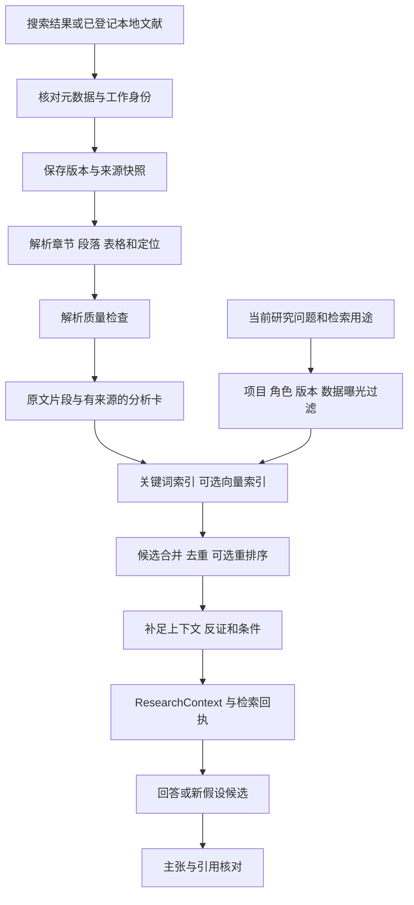

# TODO 驱动的论文 RAG 与科研评测方案

日期：2026-09-16。状态：探索与设计，供审阅；尚未实现检索服务、建立索引或运行 benchmark。本文是 [AutoResearch 总方案](proposal.md) 的文献与评测专项补充。

## 1. 本轮回答什么

[根 TODO](../../TODO.md) 提出了三件事：保存已搜索论文并做简单 RAG；设计论文信息表头；研究其他 Research Agent 的实验制作方式，为自己的 benchmark 做准备。“表头”在本方案中指论文目录字段，同时补充全文章节和表格的解析要求。

RAG 是在模型回答或作出研究决定前，检索相关原始资料并把有出处的内容提供给模型。本项目要同时回答：找到什么论文、读到了哪部分、哪句话支持什么判断，以及这些资料怎样影响下一实验。

**建议：先建可追溯的论文目录与原文片段检索基线，接入现有 ResearchContext，再通过评测增加混合检索。** 文献 RAG 可提前成为独立交付，不必等待大型运行时改造；实验结果反馈与长任务恢复仍沿用总方案。

专题阅读：

- [科学文献 RAG 方法](rag-literature-methods.md)：OpenScholar、PaperQA 等系统的检索与证据组织。
- [索引与长期记忆](rag-index-and-memory.md)：图检索、增量更新与版本一致性。
- [RAG 与科研 benchmark](rag-and-research-benchmark-design.md)：外部任务协议、评估器与本项目试点。
- [解析和入库依据](rag-ingestion-notes.md)：元数据、PDF/HTML、表格、切块与中英检索。

## 2. 代码现状：可复用与缺口

| 现有位置 | 实际能力 | 要增加的能力 |
|---|---|---|
| [PaperRecord](../../packages/autoresearch/src/brainstorm/paper-record.ts) | title、arxivId、doi、url、year、venue、citations、abstract；方法、结果、局限等分析字段 | authors、明确版本、元数据来源、实际读取范围、原文定位、解析状态；把作者原话与 Agent 判断区分 |
| [normalize.ts](../../packages/autoresearch/src/brainstorm/normalize.ts) | 规范化 survey/frontier 输出并去重 | 目前 key 按 arXiv/DOI/URL/title 优先选一个，无法可靠关联跨入口别名和不同版本；需要登记别名和冲突 |
| [pipeline.ts](../../packages/autoresearch/src/brainstorm/pipeline.ts)、[wiki-render.ts](../../packages/autoresearch/src/brainstorm/wiki-render.ts) | 写 paper_records.json、paper_wiki；prompt 要求真实搜索 | 结构化输出本身不证明真的获取了原文。需要搜索回执、来源快照、段落读取与索引契约 |
| [deep-dive.ts](../../packages/autoresearch/src/brainstorm/deep-dive.ts) | 围绕 idea 调用 survey/frontier，返回 relatedPapers/baselines 文本；按 citations 取前三个 baseline | baseline 应按任务、数据、指标、计算预算和实现可用性匹配；relatedPapers 改为带来源的检索包 |
| [curated-papers.ts](../../packages/autoresearch/src/brainstorm/curated-papers.ts) | 用时效、引用、角色/venue 选阅读名单 | 阅读优先级与实验基线适用性分开；新增文献/负结果不能因引用少而被系统性排除 |
| [knowledge-graph.ts](../../packages/autoresearch/src/brainstorm/knowledge-graph.ts) | 论文、综述、方向、开放问题关系及展示 | 这些关系主要来自归类和 Agent 输出；没有原文证据边和查询时图遍历检索。已有 KG 不等于已接通 GraphRAG |
| [references.ts](../../packages/autoresearch/src/paper/references.ts) | 根据 BibTeX 下载 PDF，记录 bytes/hash/citations.json | 没有全文解析和段落索引；缓存也主要以引用 key 的文件名识别，需要统一 source identity/version 后复用 |
| 分支 [research-context/select.ts](../../.worktrees/evidence-driven-research/packages/autoresearch/src/research-context/select.ts) | 作用域/角色/失效依赖过滤；保留 required、反证、冲突；完整记录预算 | 当前相关性是 queryTerms 的子串命中，尚无全文倒排/向量/reranker；新增检索结果必须接回这些约束 |
| 分支 [service/research-context.ts](../../.worktrees/evidence-driven-research/packages/autoresearch/src/service/research-context.ts) | 从已提交 snapshot 构建研究输入，worker 有单独可见边界 | 文献检索器需作为显式输入源接入，不能向 worker 自动加入所有历史结果 |
| [workbench.js](../../packages/autoresearch-web/src/workbench.js)、[workbench-client.js](../../packages/autoresearch-web/src/workbench-client.js) | 已有论文编辑/PDF.js 预览与受控 PDF 路由 | 已找到文献目录、原文片段跳转和论文跨文档搜索尚须接入；不能照旧 TODO 把现有 PDF 预览也写成完全未实现 |

本轮检查的是当前 main 工作区源码和 `feat/evidence-driven-research@5034eb1`，不是仅比较两个提交的干净版本。未重新执行产品测试。DSH 子 Agent 可能使用其宿主搜索工具；缺的是 AutoResearch 自己能重用、核验和评测的检索记录契约，不能据此断言整个宿主不能联网搜索。

## 3. 三条路线及推荐

| 路线 | 内容 | 取舍 |
|---|---|---|
| A：仅论文卡片检索 | 在现有标题、摘要、wiki 上做关键词/语义检索 | 最快获得目录问答；无法可靠回答具体实验数值和条件。可作为导入旧资料的探索模式和对照组 |
| **B：目录 + 原文片段 + 可选混合召回** | 先版本化目录/出处 + 关键词检索；增加全文、向量召回和可选重排序 | **推荐。** 每步能独立评测，适合本地 TypeScript 项目，先控制部署和索引成本 |
| C：完整图与多模态 Agentic RAG | 实体关系抽取、多跳搜索、层级摘要、视觉检索和反复查询 | 有跨论文多跳/表格查询需求时再做；建图、刷新、错误传播和评估成本都更高 |

首版不训练 retriever，不立即部署向量数据库，不全量创建本体和实体图。统一接口保留升级空间；只有同预算评测显示稳定增益，才把更复杂方法设为默认。

## 4. 论文表头：显示字段与底层记录

### 4.1 用户看到的目录

默认表头建议为：

```text
论文ID | 标题 | 作者 | 年份/版本 | 出版状态 | 研究问题 | 方法 |
实验任务/数据 | 核心结果 | 局限/反证 | 与当前研究的关系 |
基线适用性 | 读取范围 | 来源定位 | 入库状态
```

| 表头 | 字段建议 | 填写规则 |
|---|---|---|
| 论文ID | work_id | 系统稳定 ID；DOI/arXiv 作为别名，不让临时 s001/l001 充当跨 run 身份 |
| 标题、作者 | title、authors | 来自已核对元数据；拿不到作者保持 unknown，不要求模型补齐 |
| 年份/版本 | published_at、updated_at、version_id | 首发、更新、期刊日期分开；不只保存 year |
| 出版状态 | publication_type、venue、update_status | preprint/article 等与是否撤稿/更正分开；预印本不等于已同行评审 |
| 研究问题、方法 | question、methods | 派生分析，必须附 source span 或标注 only_abstract/unverified |
| 实验任务/数据 | task、datasets、split、metric、budget | 作者报告的配置；缺省用 unknown，不从相关论文继承 |
| 核心结果 | reported_findings | 标注 author_reported；数值同时绑定对照、单位、条件、表/节位置 |
| 局限/反证 | author_limitations、our_critique | 作者自述与我们的推断分列；允许双方不一致 |
| 与当前研究的关系 | relevance、role | 综述/方法/基线候选/批评/负结果等；不是科学支持 verdict |
| 基线适用性 | baseline_fit | matched/mismatch/unknown，展开可查看具体条件和实现入口 |
| 读取范围 | reading_coverage | metadata/abstract/sections/full_text；sections 记录实际章节，读完整篇不代表复现 |
| 来源定位 | version_url、locator_refs | 展开到章节、段落、页码/表格或 HTML 锚点；没有页码时不编造 |
| 入库状态 | acquisition、parse、index 状态 | 分别记录；已下载、已解析、已索引、已阅读不是同一件事 |

摘要、引用次数及其 provider/查询日期、代码链接、许可证、来源 hash 放在详情。引用次数可以辅助阅读排序，不作为科学真实性或 baseline 强度的判定条件。

### 4.2 六种逻辑记录即可，不要求六个服务

| 记录 | 最小信息 | 目的 |
|---|---|---|
| Work | work_id、canonical metadata、identifier aliases、metadata source refs | 关联同一工作的不同入口；保留身份冲突 |
| DocumentVersion | work/version IDs、source URL、fetched_at、raw hash、format、版本关系、授权/可见范围 | 保存实际读到的那份资料；版本之间不覆盖 |
| SourceSpan | span_id、document version、parser/version、section_path、text/table、定位、content_hash | 索引和引用的原文单元；表格保留行列标题、单位与脚注 |
| AnalysisCard | card_id、version、claim/方法/实验等字段、source span IDs、作者/Agent归属、生成来源、核验状态 | 现有 PaperInsight 的可追溯升级；不把模型总结存成作者原话 |
| IndexGeneration | generation_id、corpus manifest hash、chunker/tokenizer/encoder/reranker版本及配置、记录映射 | 可重建的倒排/向量/关系派生索引 |
| RetrievalReceipt | query、用途/role/scope、generation、候选与最终选中 IDs、排序来源、时间/费用、context hash | 记录每次模型实际可见资料；可恢复和审计 |

ResearchStore 继续是科研决策的规范事实源。论文 registry 保存外部来源，不能自行改变 hypothesis 的 supported/refuted。论文目录、图和索引不会变成另一套相互覆盖的科研状态。

与现有分支接入时，可通过 [SourceRef/captureBytes](../../.worktrees/evidence-driven-research/packages/autoresearch/src/research/store.ts) 绑定选中资料的字节与 manifest；只把本次用到的来源引用带入 snapshot，不把整个论文库塞进 snapshot JSON。

### 4.3 身份、版本和旧记录迁移

- DOI 规范化、arXiv base ID 与 vN 分离；abs/pdf/HTML 的入口可以指向同一 work，但内容快照分别存储。
- arXiv 与期刊版本仅在元数据关系或人工核对支持时关联。标题相似只能生成待确认匹配，不能自动合并；同一论文的多个版本也不是多项独立支持证据。
- 原文中引用另一篇论文只建立“引用关系”；没有读取后者时，不能给后者生成仿佛读过的方法/结果。
- `paper_records.json` 和 wiki 的历史记录先标 `legacy_unverified`；已有摘要也要区分 provider 原文与 Agent 转述。查到来源后逐项补证，不批量标 validated。
- 已存在 citations.json 的 PDF/hash 可导入；重新核对引用 key 与实际标题/版本，不以文件名相同认定内容相同。

元数据来源可用官方 arXiv/出版社页面与 Crossref；API metadata 可缺失或冲突，不提供科学结论的真实性保证。相关接口依据见 [入库笔记](rag-ingestion-notes.md)。

## 5. 首版入库与检索流程



### 5.1 获取和解析

1. 搜索 adapter 返回 paper candidates + provider/query/time/source receipt。可导入已有合法本地资料，不要求先联网遍历所有引用。
2. 获取时记录 `metadata_only / abstract_only / acquired / unavailable`。全文不可用仍可参与目录检索，明确禁止对未读的方法或数值作断言。
3. 优先解析可用的结构化 HTML/JATS；PDF 使用可替换 adapter，保留原 PDF。HTML 与 PDF 对齐未经核对时，只引用各自定位。
4. 数字 PDF 的普通文本、双栏、表格、公式、扫描页面分别记录质量。只对有需求且低质量的页启用 OCR/VLM；无法可靠解析则排除该片段或要求检查，不以流畅总结掩盖损坏。
5. 分节/段落切块，附标题与章节路径。表格数值和行列标题、caption、单位、脚注保持绑定；大表可拆成带完整标题的子表，保留原表引用。
6. `evidence_text` 保留原始解析文本；供搜索用的标题前缀、中文翻译或摘要写入独立 `retrieval_text`。答案引用前者，防止模型生成的检索辅助文本被当原文。

首轮可评估 256/512/1024 token 的切块规模，作为开发集参数候选，非承诺的最佳配置。跨段解释缺失时展开父段/相邻段，而不是总把整篇正文注入。

### 5.2 三个递进版本

- **R0 可追溯关键词基线：** 正式身份/原文定位、字段过滤、标题摘要与正文分开索引、BM25/全文搜索、来源引用与不知道时返回缺口。
- **R1 混合检索：** R0 候选与向量候选取并集，按排名融合，按 work/version 和重叠 span 去重；再按查询需要展开局部内容。两路分数不能直接相加当成同一量纲。RRF 是可评估的简单融合选择。[原始工作](https://research.google/pubs/reciprocal-rank-fusion-outperforms-condorcet-and-individual-rank-learning-methods/)
- **R2 有界增强：** top-N 重排序、引用追踪、多跳查询、层级摘要或图检索；以缺失变量/冲突/召回不足触发，记录最大轮数、总费用、停止原因。不能检索到“支持预期答案”为止。

首版建议本地 SQLite 元数据/FTS 或等价可移植实现，原始产物按 hash 存储。嵌入从小库精确搜索起步；只有延迟/规模证据需要时再上近似索引或独立向量服务。SQLite 驱动与 FTS 可用性须在项目 Node/Windows 运行环境验证；本轮未安装。

中英混合问题另测：中文分词、英文缩写、短术语、数学符号与中译英扩展。FTS5 默认 unicode61 不是中文词语切分器，trigram 对短于 3 字符的全文查询存在限制；不能把 FTS 可用等同于中文检索可用。[FTS5 官方说明](https://www.sqlite.org/fts5.html)

### 5.3 选择和生成的边界

- 先按权限、project/run/treatment/split、版本与用途过滤，再召回；跨项目仅共享明确允许的公共来源。当前正式实验的隐藏评分资料不能经缓存、向量或摘要旁路进入 prompt。
- 数据曝光记录包含生成器、查询改写器、embedding、reranker 和摘要器实际处理过的内容。隐藏答案不进入可被研究 Agent 使用的索引；检索缓存键同时绑定 generation、scope/访问策略、用途及模型配置。
- 在 RAG 候选不足时，允许记录“无足够资料”；同时区分 no_match、source_unavailable、parse_failed、budget_exhausted，后者不能被描述为文献不存在。
- 外部文章中的主张标 `author_reported`，经过出处核验不等于本地独立复现。文章相互引用也不等于独立支持。
- 每个生成主张附具体 span IDs；来源存在、内容支持、适用条件三项分别评估。只有 DOI/标题不能支撑一个实验数值。
- 沿用现有 context 反证/冲突闭包。检索只能保护已登记或检索发现的反证，不能承诺发现所有反证；召回完整性必须单独评测。

## 6. 如何进入研究循环

### 6.1 按用途检索

| 调用点 | 检索目的 | 典型输入/输出 |
|---|---|---|
| brainstorm/deep-dive | 领域定位与竞争解释 | 问题、机制、约束 → 综述/方法/批评片段和检索缺口 |
| experiment planner | 找可比较 baseline 和可执行方法 | task、data、metric、budget → 方法步骤、官方实现、匹配矩阵 |
| evidence assessment 后 | 解释异常并设计区分实验 | 合法可见观察、未知、冲突 → 相似设置、失败边界、替代解释 |
| paper writer/auditor | 核对报告主张 | draft claim → 具体来源、支持范围、条件、冲突/不支持 |

“实验异常”检索优先使用已准入观察，工程错误同时查询 procedure memory；OOM 不自动转成机制反证。每次新假设记录用过的文献 span 和内部证据 IDs。下一轮正式验证仍遵循已冻结的数据使用规则。

### 6.2 一个贯穿例子

研究问题：“结构化经验检索是否能减少重复实验？”

1. 检索候选来源时分别找方法、反例和适用边界，返回明确阅读范围与出处。
2. planner 比较无记忆、摘要记忆、关键词检索和混合检索；在相同候选/上下文/总预算约束下冻结规则。
3. 假如有效观察显示重复减少但费用增加，assessment 保留这两个结果；不能只把“重复减少”注入 prompt。
4. 下一次检索围绕“何时有必要检索、怎样触发检索”展开。模型提出条件检索假设，引用父版本、观察和新文献。
5. selector 选择能够区分“检索质量提高”与“只是额外计算更多”的实验，使用未参与该选择的正式评估任务。

这里的结果是假设性示例，不是本项目已完成的实验。

## 7. baseline 不再按引用数决定

增加一张小型 baseline 匹配表：任务/数据版本、split、评价指标及方向、模型/算力预算、可改组件、代码入口、依赖许可证/访问状态、原文实验位置、预计复现成本。

先过滤明显不兼容项，再选直接相关方法、资源匹配的强基线和简单消融。只有摘要而无实现/配置时保留为候选；没有匹配 baseline 时明确记录，不让模型凭空补出“文献最强方法”。

该表主要改变 [deep-dive.ts](../../packages/autoresearch/src/brainstorm/deep-dive.ts) 的 baseline 生成依据，curated 文献排序仍可独立保留。首次实现时不需要 LLM 为所有论文打复杂总分。

## 8. 长期运行和 PDF 阅读器如何衔接

索引生成走 `pending → building → validated → active`，只有完整 generation 才发布。任务保存 raw/parser/chunker/model hashes，重启复用已完成步骤；仅在来源与相应处理指纹均未改变时复用解析/嵌入。文献新版本产生新记录，旧运行保留原版本引用。

一个研究 run 默认固定 corpus/index generation。显式发现新文献时，登记知识更新事件与 exposure，再允许后续调用使用新 generation；不能在 resume 时悄悄改用“最新”。撤稿/更正或权限变化不应被冻结机制屏蔽：生成失效/访问事件，保留旧决策历史，并按规则暂停或重新审查受影响主张。

[draft TODO](../../docs/drafts/TODO.md) 的“已找到文献”入口可消费同一目录：列表 → 阅读范围 → 命中段落 → 对应版本 PDF/HTML。浏览器只持有已登记 project/artifact/version/span IDs；GET 阅读不启动下载、解析、索引或编译任务。现有工作台预览可复用组件，但现有路由指向生成论文 PDF，仍需增加文献 artifact 注册与定位契约。

更详细的失效、缓存和图更新策略见 [索引专题](rag-index-and-memory.md)。

## 9. benchmark：先测检索，再测对科研有没有帮助

不等待 RAG 全部做完才设计测试集。先冻结试点评测内容，避免根据已看到的测试问题修改系统。

| 层次 | 输入和动作 | 主要指标 |
|---|---|---|
| B0 资料与解析 | 核对身份/版本、定位段落/表格 | 错误合并、版本混淆、表格数值/单位、定位可回查率 |
| B1 文献检索 | 单篇、多篇、反证、无答案、中英问题 | evidence recall、nDCG、不同 work 覆盖、必要条件/反证召回、延迟/成本 |
| B2 有引用的回答 | 根据检索包回答并报告不足 | 主张支持率、引用精度与覆盖、正确保留未知、错误断言率 |
| B3 研究决策 | 选择 baseline/下一实验/停止 | 协议合规、竞争解释覆盖、无依据重复尝试、真实有效证据成本 |
| B4 端到端与恢复 | 真实运行任务，注入中断并继续 | 独立复现、预算内结果曲线、重复提交、恢复时间、人工介入 |

预试点可以从 20 篇不同 work、40 个人工核对问题（按关联工作划分 dev/test）开始，类别覆盖上表，另加 3–5 个本地可运行研究任务。**这些数量仅用于调通评测，不足以支持广泛优越性结论。** 正式规模根据试点任务间方差、目标改善与标注资源确定。

对照至少含：现有卡片/摘要输入、可追溯关键词 RAG、同语料同切块混合 RAG、再加 rerank。图检索、查询改写和摘要分别消融；保留 oracle evidence 上界以区分“没找着”和“找着但没正确使用”。对小语料加入受相同上下文预算约束的长上下文读取基线。

语料中的原文答案是检索任务的合法输入，评测问题的参考答案/标签仍由 evaluator 隐藏；不把普通 QA 的全文可见规则误套到研究实验的 held-out 数据。开发集与测试集按 work family/任务族划分，不能仅按 chunk 随机分割。

固定模型、资料、上下文与总费用，同时报告索引冷启动成本、增量更新成本、单次查询成本和多轮摊销。统计时以 work/任务为独立单位，重复种子和多条同源问题不能当独立论文；公开所有失败、未知、超时与预算停止。参考 [benchmark 专题](rag-and-research-benchmark-design.md) 中的外部任务协议和对照设计。

## 10. 建议交付顺序与代码落点

以下是建议路径，尚未创建运行模块。

| 阶段 | 落点 | 验收条件 |
|---|---|---|
| L0 目录与字段 | `brainstorm/paper-record.ts` + 新 `literature/catalog`；旧 records 导入 | 正确处理 DOI/arXiv 别名、版本冲突、未知元数据和阅读范围；不伪造 source span |
| L1 原文与关键词基线 | 新 `literature/acquisition`、`parsing`、`spans`、`retrieval`；复用 references 下载记录 | 每个结果回到原文；摘要不冒充全文；中英短查询、表格单位和无答案样例通过 |
| L2 研究接入 | 新 `literature/context-adapter`；接入 deep-dive、idea 与分支 ResearchContext | 新假设有文献/内部观察来源；必要反证保留；worker 可见边界不变；baseline 按条件匹配 |
| L3 混合召回 | 可选 embedding/rerank adapter，索引 generation/receipt | 在冻结的 B1/B2 上比较召回与成本；失败可回到 L1；禁止混用不同 encoder 的向量 |
| L4 实验与工作台 | benchmark 任务/外部 evaluator；文献目录和原文定位 UI | 完成真实 provider 试跑后再谈端到端性能；UI 阅读无隐式执行 |
| L5 高级检索 | 有界多跳、摘要层级、图或视觉检索 | 只针对已观察到的失败模式启用，并经过相同总预算消融 |

资料及索引任务复用总方案的 job/预算/恢复契约。新 parser 若依赖 Python/Java 可作显式 adapter，TypeScript 主控制流不重写；安装方式、离线模型和平台兼容性在实施时核验。

## 11. 本轮结论与未完成项

已完成的是 TODO 对照、代码差距检查、一手文献阅读和可审阅设计。没有安装数据库/解析器、建立向量索引、执行在线基准、验证真实 CPA/provider，相关实现待办保持未勾选。

下一批最小可实施范围是 **L0 + L1 + B0/B1 试点**。它先证明论文身份、读取范围、原文定位和检索质量可信，再决定 L2/L3 的扩展。根 TODO 保留原始目标，并附本轮设计入口。
